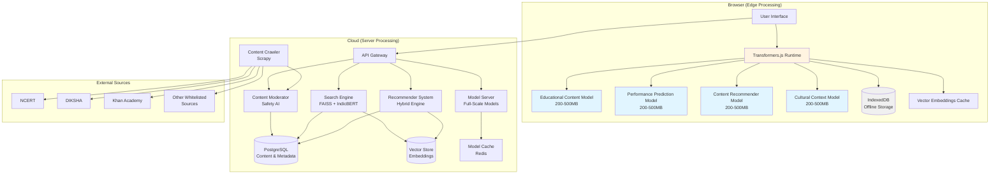
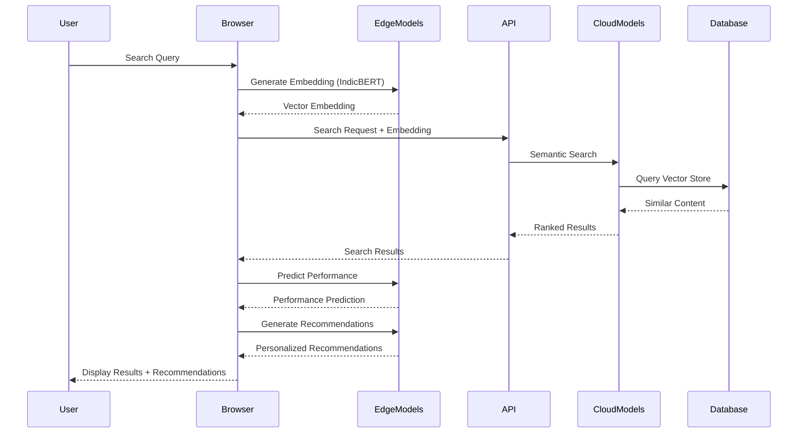
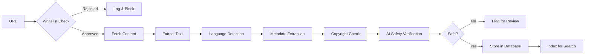

# Design Document: Advanced AI Architecture

## Overview

The Advanced AI Architecture for MindHangar implements a comprehensive AI system with four custom pretrained models, an educational content crawler, a multi-language semantic search engine, and a hybrid recommender system. The architecture uses a hybrid edge-cloud approach with Transformers.js for browser-based inference and server-side processing for computationally intensive tasks.

### Key Design Principles

1. **Privacy-First**: Sensitive operations use edge processing in the browser
2. **Offline-First**: Core AI features work without internet connectivity
3. **Mobile-Optimized**: Models sized 200-500MB for mobile devices
4. **Multi-Language**: Native support for 8 Indian languages using IndicBERT/IndicBART
5. **Safety-First**: Whitelist-only crawling with AI-powered content moderation
6. **Hybrid Intelligence**: Combines collaborative filtering, content-based filtering, and deep learning
7. **Scalable**: Designed to support millions of concurrent users

### Technology Stack

- **Browser AI**: Transformers.js for edge inference
- **Indian Language Models**: IndicBERT, IndicBART, ai4bharat models
- **Web Crawling**: Scrapy with custom safety middleware
- **Vector Search**: FAISS for similarity search with IndicBERT embeddings
- **Storage**: IndexedDB for offline data, PostgreSQL for server data
- **Model Serving**: ONNX Runtime for optimized inference
- **API**: REST and WebSocket for real-time updates

## Architecture

### System Architecture Diagram



### Data Flow Architecture



### Edge-Cloud Processing Decision Matrix

| Operation | Processing Location | Rationale |
|-----------|-------------------|-----------|
| Content Classification | Edge | Fast, privacy-preserving |
| Performance Prediction | Edge | Sensitive user data |
| Quick Recommendations | Edge | Low latency, offline support |
| Search Query Embedding | Edge | Fast, offline capable |
| Content Crawling | Cloud | Resource intensive |
| Bulk Recommendations | Cloud | Large dataset processing |
| Model Training | Cloud | Computational power required |
| Content Moderation | Cloud | Centralized safety control |
| Vector Similarity Search | Cloud | Large vector database |

## Components and Interfaces

### 1. Educational Content Model

**Purpose**: Classify and extract metadata from Indian educational content

**Model Architecture**:
- Base: IndicBERT-v2 (multilingual)
- Fine-tuned on: NCERT, DIKSHA, NPTEL datasets
- Output: Board, Grade, Subject, Topic, Difficulty, Learning Objectives
- Size: 400MB (quantized)
- Accuracy: >85% on test set

**Interface**:
```typescript
interface EducationalContentModel {
  // Initialize model in browser
  initialize(): Promise<void>;
  
  // Classify content
  classifyContent(text: string, language: Language): Promise<ContentClassification>;
  
  // Extract metadata
  extractMetadata(content: string): Promise<ContentMetadata>;
  
  // Batch processing
  classifyBatch(texts: string[]): Promise<ContentClassification[]>;
  
  // Check if model is loaded
  isReady(): boolean;
  
  // Unload model to free memory
  unload(): Promise<void>;
}

interface ContentClassification {
  board: Board;              // CBSE, ICSE, State boards
  grade: number;             // 1-12
  subject: Subject;          // Math, Science, etc.
  topic: string;             // Specific topic
  difficulty: Difficulty;    // Easy, Medium, Hard
  confidence: number;        // 0-1
}

interface ContentMetadata {
  learningObjectives: string[];
  prerequisites: string[];
  estimatedTime: number;     // minutes
  contentType: ContentType;  // Video, Text, Quiz, etc.
  curriculumAlignment: CurriculumAlignment[];
}
```

**Implementation Details**:
- Uses Transformers.js for browser inference
- ONNX format for optimized performance
- Quantized to INT8 for size reduction
- Progressive loading: core model first, then fine-tuned layers
- Caches results in IndexedDB for 7 days

### 2. Performance Prediction Model

**Purpose**: Predict student performance and identify learning gaps

**Model Architecture**:
- Base: Transformer encoder with attention mechanism
- Input: Student activity history, assessment scores, time spent
- Output: Performance prediction, gap identification, difficulty recommendation
- Size: 300MB (quantized)
- Accuracy: >80% on validation set

**Interface**:
```typescript
interface PerformancePredictionModel {
  // Initialize model
  initialize(): Promise<void>;
  
  // Predict performance on upcoming assessment
  predictPerformance(
    studentHistory: StudentActivity[],
    targetAssessment: Assessment
  ): Promise<PerformancePrediction>;
  
  // Identify learning gaps
  identifyGaps(
    studentHistory: StudentActivity[],
    curriculum: CurriculumNode[]
  ): Promise<LearningGap[]>;
  
  // Recommend difficulty adjustment
  recommendDifficulty(
    currentDifficulty: Difficulty,
    recentPerformance: Performance[]
  ): Promise<DifficultyRecommendation>;
  
  // Check readiness
  isReady(): boolean;
}

interface PerformancePrediction {
  predictedScore: number;      // 0-100
  confidence: number;          // 0-1
  weakTopics: Topic[];
  strongTopics: Topic[];
  recommendedStudyTime: number; // minutes
}

interface LearningGap {
  topic: Topic;
  severity: 'low' | 'medium' | 'high';
  remedialContent: ContentReference[];
  estimatedTimeToClose: number; // minutes
}

interface DifficultyRecommendation {
  recommendedDifficulty: Difficulty;
  reasoning: string;
  confidence: number;
}
```

**Implementation Details**:
- Runs entirely on edge for privacy
- Uses sliding window of last 50 activities
- Updates predictions in real-time as user interacts
- Stores predictions in IndexedDB
- No data sent to server

### 3. Content Recommender Model

**Purpose**: Generate personalized content recommendations using hybrid approach

**Model Architecture**:
- Hybrid: Collaborative Filtering + Content-Based + Deep Learning
- Collaborative: Matrix factorization (SVD)
- Content-Based: IndicBERT embeddings + cosine similarity
- Deep Learning: Neural collaborative filtering
- Size: 450MB (quantized)
- CTR: >70% target

**Interface**:
```typescript
interface ContentRecommenderModel {
  // Initialize model
  initialize(): Promise<void>;
  
  // Get next content recommendation
  recommendNext(
    userId: string,
    currentContent: Content,
    userHistory: UserActivity[]
  ): Promise<ContentRecommendation[]>;
  
  // Get similar content
  recommendSimilar(
    content: Content,
    count: number
  ): Promise<ContentRecommendation[]>;
  
  // Adjust difficulty
  recommendDifficultyAdjusted(
    currentContent: Content,
    performanceHistory: Performance[]
  ): Promise<ContentRecommendation[]>;
  
  // Exam preparation recommendations
  recommendForExam(
    exam: Exam,
    userHistory: UserActivity[],
    timeAvailable: number
  ): Promise<ContentRecommendation[]>;
  
  // Gap filling recommendations
  recommendForGaps(
    gaps: LearningGap[]
  ): Promise<ContentRecommendation[]>;
  
  // Cold start recommendations
  recommendColdStart(
    userProfile: UserProfile
  ): Promise<ContentRecommendation[]>;
  
  // Update with user interaction
  updateWithInteraction(
    interaction: UserInteraction
  ): Promise<void>;
}

interface ContentRecommendation {
  content: Content;
  score: number;              // 0-1
  reasoning: RecommendationReason;
  type: RecommendationType;
}

type RecommendationType = 
  | 'next_content'
  | 'similar_content'
  | 'difficulty_adjusted'
  | 'exam_prep'
  | 'gap_filling';

interface RecommendationReason {
  primary: string;
  factors: RecommendationFactor[];
}

interface RecommendationFactor {
  factor: string;
  weight: number;
}
```

**Implementation Details**:
- Hybrid scoring: 40% collaborative, 30% content-based, 30% deep learning
- Edge model for quick recommendations (cached user data)
- Cloud model for comprehensive recommendations (full dataset)
- Real-time updates with exponential decay
- Cold start: curriculum-based + popularity-based
- A/B testing framework for recommendation strategies

### 4. Cultural Context Model

**Purpose**: Ensure content is culturally appropriate for Indian students

**Model Architecture**:
- Base: IndicBERT fine-tuned on cultural appropriateness dataset
- Training data: Manually labeled Indian educational content
- Output: Appropriateness score, flagged issues, age suitability
- Size: 350MB (quantized)
- Accuracy: >90% on test set

**Interface**:
```typescript
interface CulturalContextModel {
  // Initialize model
  initialize(): Promise<void>;
  
  // Evaluate cultural appropriateness
  evaluateContent(
    content: string,
    language: Language,
    targetAge: number
  ): Promise<CulturalEvaluation>;
  
  // Batch evaluation
  evaluateBatch(
    contents: ContentItem[]
  ): Promise<CulturalEvaluation[]>;
  
  // Check festival content
  evaluateFestivalContent(
    content: string,
    festival: Festival
  ): Promise<FestivalEvaluation>;
}

interface CulturalEvaluation {
  isAppropriate: boolean;
  confidence: number;
  issues: CulturalIssue[];
  ageSuitability: AgeRange;
  recommendations: string[];
}

interface CulturalIssue {
  type: IssueType;
  severity: 'low' | 'medium' | 'high';
  description: string;
  location: TextSpan;
}

type IssueType =
  | 'cultural_insensitivity'
  | 'religious_content'
  | 'inappropriate_language'
  | 'age_inappropriate'
  | 'stereotyping';

interface FestivalEvaluation {
  festival: Festival;
  isAccurate: boolean;
  culturalContext: string;
  educationalValue: number;
}
```

**Implementation Details**:
- Integrates with existing CulturalFilter service
- Uses rule-based filters + ML model
- Flags content for manual review when confidence < 0.8
- Supports all 8 Indian languages
- Updates quarterly with new cultural guidelines

### 5. Educational Content Crawler

**Purpose**: Safely collect educational content from whitelisted sources

**Architecture**:
```typescript
interface ContentCrawler {
  // Start crawling job
  startCrawl(config: CrawlConfig): Promise<CrawlJob>;
  
  // Stop crawling job
  stopCrawl(jobId: string): Promise<void>;
  
  // Get crawl status
  getCrawlStatus(jobId: string): Promise<CrawlStatus>;
  
  // Add domain to whitelist
  addToWhitelist(domain: WhitelistEntry): Promise<void>;
  
  // Remove domain from whitelist
  removeFromWhitelist(domain: string): Promise<void>;
  
  // Get whitelist
  getWhitelist(): Promise<WhitelistEntry[]>;
}

interface CrawlConfig {
  domains: string[];
  maxDepth: number;
  maxPages: number;
  respectRobotsTxt: boolean;
  rateLimit: number;          // requests per second
  languages: Language[];
  contentTypes: ContentType[];
  schedule?: CrawlSchedule;
}

interface CrawlJob {
  id: string;
  status: 'running' | 'paused' | 'completed' | 'failed';
  startTime: Date;
  pagesProcessed: number;
  pagesTotal: number;
  contentExtracted: number;
  errors: CrawlError[];
}

interface WhitelistEntry {
  domain: string;
  category: 'government' | 'educational' | 'nonprofit';
  verifiedBy: string;
  verifiedDate: Date;
  allowedPaths: string[];
  blockedPaths: string[];
}

interface CrawlSchedule {
  frequency: 'daily' | 'weekly' | 'monthly';
  time: string;              // HH:MM format
  timezone: string;
}
```

**Implementation Details**:
- Built on Scrapy framework
- Custom middleware for whitelist enforcement
- Respects robots.txt and rate limits
- Extracts content using language-specific parsers
- Deduplication using content hashing
- Copyright compliance checking via metadata
- AI safety verification before storage
- Scheduled crawling during off-peak hours (2-6 AM IST)
- Distributed crawling for scalability

**Whitelist Sources**:
- NCERT (ncert.nic.in)
- DIKSHA (diksha.gov.in)
- Khan Academy (khanacademy.org)
- NPTEL (nptel.ac.in)
- SWAYAM (swayam.gov.in)
- State education boards
- Verified educational NGOs

**Content Extraction Pipeline**:


### 6. Multi-Language Search Engine

**Purpose**: Provide fast, relevant semantic search across 8 Indian languages

**Architecture**:
```typescript
interface SearchEngine {
  // Initialize search engine
  initialize(): Promise<void>;
  
  // Search content
  search(query: SearchQuery): Promise<SearchResults>;
  
  // Get search suggestions
  getSuggestions(partial: string, language: Language): Promise<string[]>;
  
  // Index new content
  indexContent(content: Content): Promise<void>;
  
  // Batch indexing
  indexBatch(contents: Content[]): Promise<void>;
  
  // Update index
  updateIndex(contentId: string, content: Content): Promise<void>;
  
  // Delete from index
  deleteFromIndex(contentId: string): Promise<void>;
  
  // Get index statistics
  getIndexStats(): Promise<IndexStats>;
}

interface SearchQuery {
  query: string;
  language: Language;
  filters?: SearchFilters;
  page?: number;
  pageSize?: number;
  includeTranslations?: boolean;
}

interface SearchFilters {
  board?: Board[];
  grade?: number[];
  subject?: Subject[];
  topic?: string[];
  difficulty?: Difficulty[];
  contentType?: ContentType[];
}

interface SearchResults {
  results: SearchResult[];
  total: number;
  page: number;
  pageSize: number;
  queryTime: number;        // milliseconds
  suggestions?: string[];
}

interface SearchResult {
  content: Content;
  score: number;            // 0-1
  highlights: TextHighlight[];
  ranking: RankingBreakdown;
}

interface RankingBreakdown {
  tfidfScore: number;
  semanticScore: number;
  curriculumScore: number;
  finalScore: number;
}

interface TextHighlight {
  field: string;
  snippet: string;
  matchedTerms: string[];
}
```

**Implementation Details**:

**Ranking Algorithm**:
```
final_score = 0.3 * tfidf_score + 0.4 * semantic_score + 0.3 * curriculum_score

where:
- tfidf_score: Traditional keyword matching
- semantic_score: Cosine similarity of IndicBERT embeddings
- curriculum_score: Alignment with user's current curriculum position
```

**Vector Embedding**:
- Uses IndicBERT for Indian languages
- 768-dimensional embeddings
- Stored in FAISS index for fast similarity search
- Edge: Cached embeddings in IndexedDB
- Cloud: Full vector store with 10M+ embeddings

**Offline Search**:
- IndexedDB stores: content metadata, embeddings, inverted index
- Offline index size: ~500MB for 10,000 content items
- Sync strategy: Download curriculum-relevant content first
- Update strategy: Incremental sync when online

**Language Support**:
- Language detection using fastText
- Language-specific tokenization and stemming
- Cross-language search using multilingual embeddings
- Translation indicators for cross-language results

**Search Optimization**:
- Query caching (Redis, 1 hour TTL)
- Result caching (Redis, 5 minutes TTL)
- Incremental indexing (5-minute batches)
- Index sharding by language and grade
- Approximate nearest neighbor search (HNSW algorithm)

### 7. Hybrid Recommender System

**Purpose**: Generate personalized recommendations using multiple strategies

**Architecture**:
```typescript
interface RecommenderSystem {
  // Initialize recommender
  initialize(): Promise<void>;
  
  // Generate recommendations
  recommend(request: RecommendationRequest): Promise<Recommendation[]>;
  
  // Update user profile
  updateUserProfile(userId: string, interaction: Interaction): Promise<void>;
  
  // Get user profile
  getUserProfile(userId: string): Promise<UserProfile>;
  
  // Train models
  trainModels(trainingData: TrainingData): Promise<TrainingResult>;
  
  // A/B test strategies
  abTest(userId: string, strategies: Strategy[]): Promise<ABTestResult>;
}

interface RecommendationRequest {
  userId: string;
  context: RecommendationContext;
  type: RecommendationType;
  count: number;
  filters?: RecommendationFilters;
}

interface RecommendationContext {
  currentContent?: Content;
  recentActivity: Activity[];
  performanceHistory: Performance[];
  learningGoals: Goal[];
  timeAvailable?: number;
  upcomingExams?: Exam[];
}

interface Recommendation {
  content: Content;
  score: number;
  confidence: number;
  reasoning: ReasoningExplanation;
  strategyUsed: Strategy;
}

interface ReasoningExplanation {
  primary: string;
  secondary: string[];
  factors: {
    collaborative: number;
    contentBased: number;
    deepLearning: number;
    curriculum: number;
    performance: number;
  };
}
```

**Recommendation Strategies**:

1. **Collaborative Filtering**:
   - Matrix factorization using SVD
   - User-user similarity: Cosine similarity of activity vectors
   - Item-item similarity: Co-occurrence patterns
   - Weight: 40% of final score

2. **Content-Based Filtering**:
   - IndicBERT embeddings for content similarity
   - Metadata matching (board, grade, subject, topic)
   - Difficulty progression
   - Weight: 30% of final score

3. **Deep Learning**:
   - Neural collaborative filtering
   - Architecture: User embedding + Content embedding → MLP → Score
   - Trained on user-content interaction data
   - Weight: 30% of final score

**Cold Start Handling**:
```typescript
interface ColdStartStrategy {
  // New user recommendations
  recommendForNewUser(profile: UserProfile): Promise<Recommendation[]>;
  
  // New content recommendations
  recommendNewContent(content: Content): Promise<User[]>;
}

// Cold start approach:
// 1. Use curriculum-based recommendations (grade + subject)
// 2. Use popularity-based recommendations (trending content)
// 3. Use demographic-based recommendations (similar users)
// 4. Gradually transition to personalized as data accumulates
```

**Real-Time Personalization**:
- Update user embeddings after each interaction
- Exponential decay for older interactions (half-life: 7 days)
- Immediate re-ranking of recommendations
- WebSocket updates for live recommendation refresh

**Recommendation Types Implementation**:

1. **Next Content**: Sequential curriculum progression + difficulty adjustment
2. **Similar Content**: Cosine similarity of embeddings + metadata matching
3. **Difficulty Adjustment**: Performance-based difficulty scaling
4. **Exam Prep**: Syllabus coverage + weak topic prioritization
5. **Gap Filling**: Learning gap identification + remedial content matching

## Data Models

### Content Model
```typescript
interface Content {
  id: string;
  title: string;
  description: string;
  language: Language;
  board: Board;
  grade: number;
  subject: Subject;
  topic: string;
  difficulty: Difficulty;
  contentType: ContentType;
  url: string;
  thumbnailUrl?: string;
  duration?: number;          // minutes
  createdAt: Date;
  updatedAt: Date;
  metadata: ContentMetadata;
  embedding: number[];        // 768-dim vector
  qualityScore: number;       // 0-1
  popularityScore: number;    // 0-1
  culturalScore: number;      // 0-1
}

type Language = 'en' | 'hi' | 'ta' | 'te' | 'bn' | 'mr' | 'gu' | 'kn';
type Board = 'CBSE' | 'ICSE' | 'State' | 'IB' | 'NIOS';
type Subject = 'Math' | 'Science' | 'English' | 'Hindi' | 'Social' | 'Computer';
type Difficulty = 'Easy' | 'Medium' | 'Hard';
type ContentType = 'Video' | 'Text' | 'Quiz' | 'Interactive' | 'PDF';
```

### User Activity Model
```typescript
interface UserActivity {
  id: string;
  userId: string;
  contentId: string;
  activityType: ActivityType;
  startTime: Date;
  endTime?: Date;
  duration: number;           // seconds
  completed: boolean;
  score?: number;             // 0-100
  interactions: Interaction[];
  metadata: ActivityMetadata;
}

type ActivityType = 'view' | 'complete' | 'quiz' | 'bookmark' | 'share';

interface Interaction {
  timestamp: Date;
  type: InteractionType;
  data: any;
}

type InteractionType = 'click' | 'scroll' | 'pause' | 'replay' | 'answer';
```

### User Profile Model
```typescript
interface UserProfile {
  userId: string;
  board: Board;
  grade: number;
  subjects: Subject[];
  preferredLanguage: Language;
  learningStyle: LearningStyle;
  goals: Goal[];
  strengths: Topic[];
  weaknesses: Topic[];
  activitySummary: ActivitySummary;
  embedding: number[];        // User embedding for recommendations
  lastUpdated: Date;
}

type LearningStyle = 'visual' | 'auditory' | 'kinesthetic' | 'reading';

interface Goal {
  type: GoalType;
  target: string;
  deadline?: Date;
  progress: number;           // 0-100
}

type GoalType = 'exam' | 'topic_mastery' | 'skill_development';

interface ActivitySummary {
  totalTime: number;          // minutes
  contentCompleted: number;
  averageScore: number;
  streak: number;             // days
  lastActive: Date;
}
```

### Model Metadata
```typescript
interface ModelMetadata {
  modelId: string;
  modelName: string;
  version: string;
  size: number;               // bytes
  format: 'onnx' | 'tfjs';
  quantization: 'int8' | 'float16' | 'float32';
  accuracy: number;           // 0-1
  latency: number;            // milliseconds
  deploymentType: 'edge' | 'cloud' | 'hybrid';
  lastUpdated: Date;
  trainingDataset: string;
  checksum: string;
}
```

### Search Index Model
```typescript
interface SearchIndex {
  contentId: string;
  language: Language;
  tokens: string[];
  embedding: number[];
  tfidfVector: number[];
  metadata: IndexMetadata;
  lastIndexed: Date;
}

interface IndexMetadata {
  wordCount: number;
  uniqueTerms: number;
  averageTermFrequency: number;
}
```

### Crawl Data Model
```typescript
interface CrawledContent {
  id: string;
  url: string;
  domain: string;
  title: string;
  content: string;
  language: Language;
  crawledAt: Date;
  lastModified?: Date;
  contentHash: string;
  metadata: CrawlMetadata;
  safetyStatus: SafetyStatus;
  processingStatus: ProcessingStatus;
}

interface CrawlMetadata {
  author?: string;
  publishDate?: Date;
  copyright?: string;
  license?: string;
  source: string;
}

interface SafetyStatus {
  isVerified: boolean;
  verifiedAt?: Date;
  verifiedBy: 'ai' | 'manual';
  issues: SafetyIssue[];
  score: number;              // 0-1
}

interface SafetyIssue {
  type: string;
  severity: 'low' | 'medium' | 'high';
  description: string;
}

type ProcessingStatus = 'pending' | 'processing' | 'completed' | 'failed';
```
