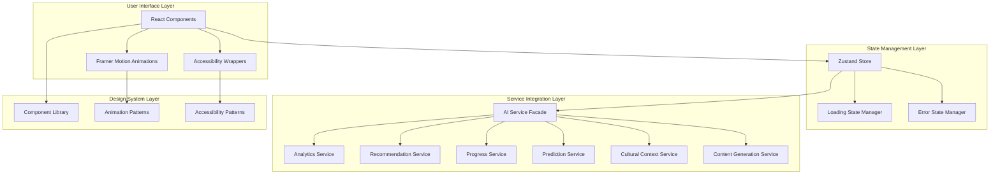

# Design Document: Frontend Modernization

## Overview

This design document outlines the technical approach for modernizing the MindHangar AI for Bharat frontend application. The modernization transforms the existing functional React application into a polished, accessible, and engaging educational platform that fully leverages sophisticated AI backend services.

The design follows a layered architecture approach:
1. **Accessibility Layer**: WCAG 2.1 AA compliant foundation with semantic HTML, ARIA attributes, and keyboard navigation
2. **Animation Layer**: Framer Motion-powered animations with performance optimization and reduced-motion support
3. **State Management Layer**: Enhanced Zustand store with AI service integration and loading state management
4. **Component Layer**: Modernized components with skeleton loading, error states, and micro-interactions
5. **Design System Layer**: Documented component library with usage guidelines and accessibility patterns

The modernization maintains backward compatibility while introducing progressive enhancements. All existing functionality remains intact, with new features added through feature flags for gradual rollout.

### Key Design Principles

1. **Accessibility First**: Every component designed with WCAG 2.1 AA compliance from the ground up
2. **Progressive Enhancement**: New features enhance but don't replace existing functionality
3. **Performance Budget**: Maintain <300KB initial bundle, <2s load time on 3G
4. **Mobile First**: Design for mobile, enhance for larger screens
5. **Cultural Sensitivity**: Respect regional preferences and cultural contexts
6. **AI Integration**: Surface AI insights naturally within existing workflows

## Architecture

### System Architecture Diagram



### Component Architecture

The application follows a hierarchical component structure:

```
App
├── AccessibilityProvider (ARIA live regions, focus management)
├── AnimationProvider (Framer Motion config, reduced motion)
├── ThemeProvider (Cultural themes, color schemes)
└── Router
    ├── Layout
    │   ├── Navbar (with skip links)
    │   ├── Sidebar (keyboard navigable)
    │   └── Main (semantic landmarks)
    └── Pages
        ├── Dashboard
        │   ├── RecommendationWidget (AI-powered)
        │   ├── ProgressVisualization (AI-powered)
        │   └── AnalyticsDashboard (AI-powered)
        ├── Learning
        │   ├── ContentPanel (with skeleton loading)
        │   ├── PredictionIndicator (AI-powered)
        │   └── CulturalAdaptation (AI-powered)
        └── Settings
            ├── AccessibilitySettings
            ├── AnimationSettings
            └── CulturalPreferences
```

### Data Flow

1. **User Interaction** → Component receives event
2. **Component** → Dispatches action to Zustand store
3. **Store** → Updates loading state, calls AI service facade
4. **AI Service Facade** → Routes request to appropriate backend service
5. **Backend Service** → Returns data or error
6. **Store** → Updates state with data or error
7. **Component** → Re-renders with new state, triggers animations
8. **Animation Layer** → Applies transitions and micro-interactions

## Components and Interfaces

### 1. Accessibility Infrastructure

#### AccessibilityProvider Component

```typescript
interface AccessibilityProviderProps {
  children: React.ReactNode;
}

interface AccessibilityContext {
  announceToScreenReader: (message: string, priority?: 'polite' | 'assertive') => void;
  setFocusTarget: (elementId: string) => void;
  skipToContent: () => void;
  registerLandmark: (id: string, label: string) => void;
}

// Provides ARIA live regions and focus management utilities
const AccessibilityProvider: React.FC<AccessibilityProviderProps>
```

**Key Features**:
- ARIA live region management for dynamic content announcements
- Focus management utilities for programmatic focus control
- Skip link implementation for bypassing repetitive navigation
- Landmark registration for semantic page structure

#### AccessibleButton Component

```typescript
interface AccessibleButtonProps {
  children: React.ReactNode;
  onClick: () => void;
  ariaLabel?: string;
  disabled?: boolean;
  variant?: 'primary' | 'secondary' | 'ghost';
  loading?: boolean;
}

const AccessibleButton: React.FC<AccessibleButtonProps>
```

**Accessibility Features**:
- Proper ARIA labels for icon-only buttons
- Keyboard navigation support (Enter, Space)
- Focus indicators with 3px outline
- Disabled state with aria-disabled
- Loading state with aria-busy

### 2. Animation System

#### AnimationProvider Component

```typescript
interface AnimationConfig {
  reducedMotion: boolean;
  duration: {
    fast: number;    // 150ms
    normal: number;  // 300ms
    slow: number;    // 500ms
  };
  easing: {
    easeIn: string;
    easeOut: string;
    easeInOut: string;
    spring: SpringConfig;
  };
}

interface AnimationProviderProps {
  children: React.ReactNode;
  config?: Partial<AnimationConfig>;
}

const AnimationProvider: React.FC<AnimationProviderProps>
```

**Key Features**:
- Respects prefers-reduced-motion media query
- Provides consistent animation timing across app
- Spring physics configuration for natural motion
- Global animation enable/disable toggle

#### Animation Variants

```typescript
// Page transition variants
const pageTransitionVariants = {
  initial: { opacity: 0, x: -20 },
  animate: { opacity: 1, x: 0 },
  exit: { opacity: 0, x: 20 }
};

// Micro-interaction variants
const buttonVariants = {
  idle: { scale: 1 },
  hover: { scale: 1.05 },
  tap: { scale: 0.95 }
};

// Scroll animation variants
const scrollFadeInVariants = {
  hidden: { opacity: 0, y: 50 },
  visible: { opacity: 1, y: 0 }
};

// Loading skeleton variants
const skeletonPulseVariants = {
  start: { opacity: 0.6 },
  end: { opacity: 1 }
};
```

### 3. Loading State Management

#### LoadingStateManager

```typescript
interface LoadingState {
  isLoading: boolean;
  loadingType: 'skeleton' | 'spinner' | 'progress' | 'optimistic';
  progress?: number; // 0-100 for progress bars
  message?: string;
}

interface LoadingStateManager {
  setLoading: (key: string, state: LoadingState) => void;
  clearLoading: (key: string) => void;
  getLoading: (key: string) => LoadingState | null;
  isAnyLoading: () => boolean;
}
```

**Loading Patterns**:
- **Skeleton**: For initial content load (cards, lists, panels)
- **Spinner**: For operations 500ms-3s (form submissions, searches)
- **Progress**: For measurable operations (file uploads, batch processing)
- **Optimistic**: For instant feedback with background sync (likes, saves)

#### SkeletonLoader Component

```typescript
interface SkeletonLoaderProps {
  variant: 'text' | 'card' | 'avatar' | 'image' | 'custom';
  width?: string | number;
  height?: string | number;
  count?: number;
  className?: string;
}

const SkeletonLoader: React.FC<SkeletonLoaderProps>
```

**Features**:
- Matches content structure for smooth transition
- Animated pulse effect using Framer Motion
- Responsive sizing based on viewport
- Accessible (aria-busy, aria-label)

### 4. Error State Management

#### ErrorBoundary Component (Enhanced)

```typescript
interface ErrorBoundaryProps {
  children: React.ReactNode;
  fallback?: React.ComponentType<ErrorFallbackProps>;
  onError?: (error: Error, errorInfo: React.ErrorInfo) => void;
}

interface ErrorFallbackProps {
  error: Error;
  resetError: () => void;
}

class ErrorBoundary extends React.Component<ErrorBoundaryProps>
```

#### ErrorState Component

```typescript
interface ErrorStateProps {
  error: Error | string;
  onRetry?: () => void;
  onDismiss?: () => void;
  variant?: 'inline' | 'modal' | 'toast';
  severity?: 'error' | 'warning' | 'info';
}

const ErrorState: React.FC<ErrorStateProps>
```

**Error Patterns**:
- **Network Error**: Show retry button, offline indicator
- **Validation Error**: Highlight field, show inline message
- **Server Error**: Show generic message, log details
- **Not Found**: Show empty state with navigation options
- **Permission Error**: Show upgrade prompt or contact support

### 5. AI Service Integration

#### AIServiceFacade

```typescript
interface AIServiceFacade {
  recommendations: RecommendationService;
  analytics: AnalyticsService;
  progress: ProgressService;
  predictions: PerformancePredictionModel;
  culturalContext: CulturalContextModel;
  contentGeneration: EducationalContentModel;
}

interface ServiceResponse<T> {
  data?: T;
  error?: Error;
  loading: boolean;
}
```

#### RecommendationWidget Component

```typescript
interface Recommendation {
  id: string;
  title: string;
  description: string;
  type: 'content' | 'activity' | 'resource';
  relevanceScore: number;
  culturalContext?: string;
}

interface RecommendationWidgetProps {
  maxItems?: number;
  onRecommendationClick: (recommendation: Recommendation) => void;
  onDismiss?: (recommendationId: string) => void;
  onFeedback?: (recommendationId: string, feedback: 'helpful' | 'not-helpful') => void;
}

const RecommendationWidget: React.FC<RecommendationWidgetProps>
```

**Features**:
- Fetches recommendations from recommendationService
- Skeleton loading during fetch
- Animated card transitions when recommendations update
- Swipe gestures on mobile to dismiss
- Accessibility: keyboard navigation, screen reader announcements

#### AnalyticsDashboard Component

```typescript
interface AnalyticsData {
  learningTime: { value: number; unit: 'minutes' | 'hours'; trend: number };
  completionRate: { value: number; trend: number };
  activityPattern: Array<{ date: string; value: number }>;
  topSubjects: Array<{ subject: string; time: number }>;
}

interface AnalyticsDashboardProps {
  timeRange: 'day' | 'week' | 'month';
  onTimeRangeChange: (range: 'day' | 'week' | 'month') => void;
}

const AnalyticsDashboard: React.FC<AnalyticsDashboardProps>
```

**Features**:
- Fetches analytics from analyticsService
- Animated charts using Recharts + Framer Motion
- Comparative data visualization (current vs previous period)
- Tooltips with detailed explanations
- Export functionality
- Responsive layout (stacked on mobile, grid on desktop)

#### ProgressVisualization Component

```typescript
interface ProgressData {
  level: number;
  xp: number;
  xpToNextLevel: number;
  badges: Array<Badge>;
  streak: number;
  achievements: Array<Achievement>;
  goals: Array<Goal>;
}

interface Badge {
  id: string;
  name: string;
  description: string;
  icon: string;
  unlockedAt?: Date;
  progress?: number; // 0-100 for locked badges
}

interface ProgressVisualizationProps {
  userId: string;
}

const ProgressVisualization: React.FC<ProgressVisualizationProps>
```

**Features**:
- Fetches progress from progressService
- Animated progress bars with spring physics
- Badge unlock animations (confetti, scale, glow)
- Streak counter with fire animation
- Goal tracking with visual progress
- Gamification elements (levels, XP, achievements)

#### PredictionIndicator Component

```typescript
interface Prediction {
  subject: string;
  predictedPerformance: number; // 0-100
  confidence: number; // 0-100
  learningGaps: Array<string>;
  recommendations: Array<string>;
  severity: 'low' | 'medium' | 'high';
}

interface PredictionIndicatorProps {
  subject: string;
  onActionClick: (action: string) => void;
}

const PredictionIndicator: React.FC<PredictionIndicatorProps>
```

**Features**:
- Fetches predictions from performancePredictionModel
- Visual severity indicators (color-coded, icons)
- Expandable details with learning gaps
- Actionable recommendations with click handlers
- Dismissible with feedback mechanism
- Accessible explanations in simple language

#### CulturalAdaptation Component

```typescript
interface CulturalContext {
  region: string;
  theme: string;
  colorPalette: Record<string, string>;
  patterns: Array<string>;
  festivals: Array<Festival>;
  preferences: Record<string, any>;
}

interface CulturalAdaptationProps {
  children: React.ReactNode;
}

const CulturalAdaptation: React.FC<CulturalAdaptationProps>
```

**Features**:
- Fetches cultural context from culturalContextModel
- Applies regional color palettes and patterns
- Shows festival banners and celebrations
- Adapts date/time/number formats
- Smooth transitions when context changes
- Respects user customization preferences

#### ContentGenerator Component

```typescript
interface GeneratedContent {
  id: string;
  type: 'explanation' | 'example' | 'exercise' | 'quiz';
  content: string;
  metadata: {
    difficulty: 'easy' | 'medium' | 'hard';
    estimatedTime: number;
    subject: string;
    topic: string;
  };
}

interface ContentGeneratorProps {
  topic: string;
  contentType: 'explanation' | 'example' | 'exercise' | 'quiz';
  onContentGenerated: (content: GeneratedContent) => void;
}

const ContentGenerator: React.FC<ContentGeneratorProps>
```

**Features**:
- Generates content using educationalContentModel
- Loading animation during generation (typing effect)
- Regenerate button for alternative content
- Quality indicators (difficulty, time estimate)
- Save/bookmark functionality
- Feedback mechanism for content quality

### 6. Mobile Gesture Support

#### GestureHandler Component

```typescript
interface GestureConfig {
  swipe?: {
    onSwipeLeft?: () => void;
    onSwipeRight?: () => void;
    onSwipeUp?: () => void;
    onSwipeDown?: () => void;
    threshold?: number; // pixels
  };
  pinch?: {
    onPinchIn?: (scale: number) => void;
    onPinchOut?: (scale: number) => void;
  };
  longPress?: {
    onLongPress?: () => void;
    duration?: number; // ms
  };
  pullToRefresh?: {
    onRefresh?: () => Promise<void>;
    threshold?: number; // pixels
  };
}

interface GestureHandlerProps {
  children: React.ReactNode;
  config: GestureConfig;
  disabled?: boolean;
}

const GestureHandler: React.FC<GestureHandlerProps>
```

**Implementation**:
- Uses Framer Motion's drag and pan gestures
- Provides visual feedback during gestures
- Prevents conflicts with native browser gestures
- Accessible fallbacks for non-touch devices

### 7. Design System Components

#### Design System Structure

```
design-system/
├── components/
│   ├── Button/
│   │   ├── Button.tsx
│   │   ├── Button.stories.tsx
│   │   ├── Button.test.tsx
│   │   └── Button.docs.md
│   ├── Input/
│   ├── Card/
│   ├── Modal/
│   └── ...
├── patterns/
│   ├── animations.ts
│   ├── accessibility.ts
│   ├── loading.ts
│   └── errors.ts
├── tokens/
│   ├── colors.ts
│   ├── typography.ts
│   ├── spacing.ts
│   └── breakpoints.ts
└── documentation/
    ├── getting-started.md
    ├── accessibility-guide.md
    ├── animation-guide.md
    └── component-api.md
```

#### Design Tokens

```typescript
// colors.ts
export const colors = {
  // Semantic colors
  primary: {
    50: '#e3f2fd',
    100: '#bbdefb',
    // ... through 900
  },
  // Accessibility-compliant contrasts
  text: {
    primary: '#1a1a1a',      // 16:1 contrast on white
    secondary: '#4a4a4a',    // 7:1 contrast on white
    disabled: '#9e9e9e',     // 4.5:1 contrast on white
  },
  // Cultural theme colors
  cultural: {
    north: { /* ... */ },
    south: { /* ... */ },
    east: { /* ... */ },
    west: { /* ... */ },
    central: { /* ... */ },
    northeast: { /* ... */ },
  }
};

// typography.ts
export const typography = {
  fontFamily: {
    sans: ['Inter', 'system-ui', 'sans-serif'],
    serif: ['Merriweather', 'Georgia', 'serif'],
    mono: ['Fira Code', 'monospace'],
  },
  fontSize: {
    xs: '0.75rem',    // 12px
    sm: '0.875rem',   // 14px
    base: '1rem',     // 16px
    lg: '1.125rem',   // 18px
    xl: '1.25rem',    // 20px
    '2xl': '1.5rem',  // 24px
    // ... through 9xl
  },
  lineHeight: {
    tight: 1.25,
    normal: 1.5,
    relaxed: 1.75,
  }
};

// spacing.ts
export const spacing = {
  0: '0',
  1: '0.25rem',   // 4px
  2: '0.5rem',    // 8px
  3: '0.75rem',   // 12px
  4: '1rem',      // 16px
  // ... through 96
};

// breakpoints.ts
export const breakpoints = {
  sm: '640px',
  md: '768px',
  lg: '1024px',
  xl: '1280px',
  '2xl': '1536px',
};
```

## Data Models

### Enhanced Zustand Store

```typescript
interface AppState {
  // Existing state (preserved)
  user: User | null;
  settings: Settings;
  panels: PanelState[];
  // ... existing 50+ properties
  
  // New state for modernization
  accessibility: AccessibilityState;
  animations: AnimationState;
  loading: LoadingStates;
  errors: ErrorStates;
  aiServices: AIServiceStates;
}

interface AccessibilityState {
  reducedMotion: boolean;
  highContrast: boolean;
  fontSize: 'small' | 'medium' | 'large';
  screenReaderActive: boolean;
  keyboardNavigationMode: boolean;
}

interface AnimationState {
  enabled: boolean;
  duration: 'fast' | 'normal' | 'slow';
  pageTransitionsEnabled: boolean;
  microInteractionsEnabled: boolean;
  scrollAnimationsEnabled: boolean;
}

interface LoadingStates {
  [key: string]: LoadingState;
}

interface ErrorStates {
  [key: string]: ErrorState;
}

interface AIServiceStates {
  recommendations: {
    data: Recommendation[];
    lastFetched: Date | null;
    loading: boolean;
    error: Error | null;
  };
  analytics: {
    data: AnalyticsData | null;
    timeRange: 'day' | 'week' | 'month';
    loading: boolean;
    error: Error | null;
  };
  progress: {
    data: ProgressData | null;
    loading: boolean;
    error: Error | null;
  };
  predictions: {
    data: Prediction[];
    loading: boolean;
    error: Error | null;
  };
  culturalContext: {
    data: CulturalContext | null;
    loading: boolean;
    error: Error | null;
  };
  contentGeneration: {
    queue: Array<{ topic: string; type: string }>;
    results: Record<string, GeneratedContent>;
    loading: boolean;
    error: Error | null;
  };
}
```

### Store Actions

```typescript
interface AppActions {
  // Accessibility actions
  setReducedMotion: (enabled: boolean) => void;
  setHighContrast: (enabled: boolean) => void;
  setFontSize: (size: 'small' | 'medium' | 'large') => void;
  
  // Animation actions
  setAnimationsEnabled: (enabled: boolean) => void;
  setAnimationDuration: (duration: 'fast' | 'normal' | 'slow') => void;
  
  // Loading actions
  setLoading: (key: string, state: LoadingState) => void;
  clearLoading: (key: string) => void;
  
  // Error actions
  setError: (key: string, error: Error | string) => void;
  clearError: (key: string) => void;
  
  // AI service actions
  fetchRecommendations: () => Promise<void>;
  refreshRecommendations: () => Promise<void>;
  dismissRecommendation: (id: string) => void;
  
  fetchAnalytics: (timeRange: 'day' | 'week' | 'month') => Promise<void>;
  
  fetchProgress: () => Promise<void>;
  
  fetchPredictions: (subject?: string) => Promise<void>;
  dismissPrediction: (id: string) => void;
  
  fetchCulturalContext: () => Promise<void>;
  updateCulturalPreferences: (preferences: Partial<CulturalContext>) => void;
  
  generateContent: (topic: string, type: string) => Promise<GeneratedContent>;
  regenerateContent: (id: string) => Promise<GeneratedContent>;
}
```

### Local Storage Schema

```typescript
interface LocalStorageSchema {
  // Existing data (preserved)
  'mindhangar-user': User;
  'mindhangar-settings': Settings;
  // ... existing keys
  
  // New data for modernization
  'mindhangar-accessibility': AccessibilityState;
  'mindhangar-animations': AnimationState;
  'mindhangar-recommendations-cache': {
    data: Recommendation[];
    timestamp: number;
    ttl: number; // 5 minutes
  };
  'mindhangar-analytics-cache': {
    data: AnalyticsData;
    timeRange: string;
    timestamp: number;
    ttl: number; // 1 hour
  };
  'mindhangar-progress-cache': {
    data: ProgressData;
    timestamp: number;
    ttl: number; // 5 minutes
  };
}
```

## Data Models (Continued)

### Animation Configuration Model

```typescript
interface AnimationConfig {
  // Global animation settings
  enabled: boolean;
  respectReducedMotion: boolean;
  
  // Timing configurations
  duration: {
    instant: 0,
    fast: 150,
    normal: 300,
    slow: 500,
    slower: 700,
  };
  
  // Easing functions
  easing: {
    linear: [0, 0, 1, 1],
    easeIn: [0.4, 0, 1, 1],
    easeOut: [0, 0, 0.2, 1],
    easeInOut: [0.4, 0, 0.2, 1],
  };
  
  // Spring physics
  spring: {
    gentle: { stiffness: 100, damping: 15 },
    bouncy: { stiffness: 300, damping: 20 },
    stiff: { stiffness: 400, damping: 30 },
  };
  
  // Animation variants by type
  variants: {
    pageTransition: MotionVariants;
    fadeIn: MotionVariants;
    slideIn: MotionVariants;
    scaleIn: MotionVariants;
    skeleton: MotionVariants;
    microInteraction: MotionVariants;
  };
}
```

### Accessibility Configuration Model

```typescript
interface AccessibilityConfig {
  // ARIA configuration
  ariaLiveRegions: {
    polite: HTMLElement | null;
    assertive: HTMLElement | null;
  };
  
  // Focus management
  focusManagement: {
    trapFocus: boolean;
    returnFocusOnClose: boolean;
    initialFocusRef: React.RefObject<HTMLElement> | null;
  };
  
  // Keyboard navigation
  keyboardShortcuts: Record<string, () => void>;
  
  // Skip links
  skipLinks: Array<{
    id: string;
    label: string;
    targetId: string;
  }>;
  
  // Landmarks
  landmarks: Array<{
    id: string;
    role: string;
    label: string;
  }>;
  
  // Color contrast
  contrastMode: 'normal' | 'high';
  
  // Text sizing
  textScale: number; // 1.0 = 100%, 1.5 = 150%
}
```

