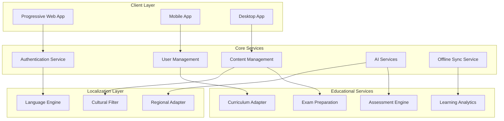

# Design Document: MindHangar AI for Bharat

## Overview

MindHangar AI for Bharat seamlessly integrates the proven MindHangar platform with Indian education ecosystem adaptations. The design preserves all core functionality (spatial workspace, AI tools, block-based notes, video learning, focus management) while adding cultural intelligence, multi-language support, and infrastructure optimization.

## Architecture

### High-Level Architecture



### Architectural Principles

1. **Feature Preservation**: All original MindHangar functionality maintained and enhanced
2. **Cultural Intelligence**: Localization and cultural adaptation as cross-cutting concerns
3. **Offline-First Design**: All core functionality available without internet connectivity
4. **Progressive Enhancement**: Features gracefully degrade based on device capabilities
5. **Microservices Architecture**: Independent, scalable services for different domains
6. **Performance Optimization**: Aggressive caching for Indian infrastructure
7. **Spatial Workspace Integrity**: Preserve panel-based interface with cultural theming
8. **AI Enhancement**: Extend original AI with cultural intelligence

## Components and Interfaces

### 1. Enhanced Spatial Workspace Engine

**Purpose**: Maintains all original MindHangar spatial workspace functionality while adding cultural theming.

**Key Interfaces**:
```typescript
interface SpatialWorkspaceEngine {
  // Original MindHangar functionality
  createPanel(type: PanelType, config: PanelConfig): Promise<Panel>
  updatePanelPosition(panelId: string, position: Position): Promise<void>
  togglePanelMaximize(panelId: string): Promise<void>
  setLayoutPreset(preset: 'Studio' | 'Cinema' | 'Research'): Promise<void>
  
  // Enhanced with cultural theming
  applyCulturalTheme(region: string, theme: CulturalTheme): Promise<void>
  integrateFestivalCalendar(region: string): Promise<CalendarIntegration>
  adaptGamificationElements(culturalContext: CulturalContext): Promise<void>
}
```

### 2. Language Engine

**Purpose**: Handles multi-language support, translation, and regional script processing.

**Key Interfaces**:
```typescript
interface LanguageEngine {
  translateText(text: string, targetLanguage: string): Promise<string>
  detectLanguage(text: string): Promise<string>
  convertScript(text: string, targetScript: string): Promise<string>
  processVoiceInput(audio: Blob, language: string): Promise<string>
  generateVoiceOutput(text: string, language: string, accent: string): Promise<Blob>
  
  // Integration with original features
  translatePanelContent(panelId: string, language: string): Promise<void>
  localizeAIResponses(response: string, culturalContext: CulturalContext): Promise<string>
}
```

**Supported Languages**: Hindi, English, Tamil, Telugu, Bengali, Marathi, Gujarati, Kannada
**Scripts**: Devanagari, Tamil, Telugu, Bengali, Gujarati, Roman

### 3. Cultural Filter

**Purpose**: Ensures all AI responses and content are culturally appropriate for Indian contexts.

**Key Interfaces**:
```typescript
interface CulturalFilter {
  filterContent(content: string, region: string): Promise<FilteredContent>
  adaptExamples(examples: Example[], culturalContext: CulturalContext): Promise<Example[]>
  validateCulturalSensitivity(response: string): Promise<ValidationResult>
  getRegionalPreferences(region: string): Promise<RegionalPreferences>
  
  // Integration with original AI features
  enhanceRoadmapGeneration(roadmap: LearningRoadmap, culturalContext: CulturalContext): Promise<LearningRoadmap>
  culturalizeQuizQuestions(questions: QuizQuestion[], region: string): Promise<QuizQuestion[]>
  adaptVideoSummaries(summary: string, culturalContext: CulturalContext): Promise<string>
}
```

### 4. Enhanced AI Services

**Purpose**: Extends original MindHangar AI capabilities with cultural intelligence.

**Key Interfaces**:
```typescript
interface EnhancedAIServices {
  // Original MindHangar AI features
  generateRoadmap(goal: string, timeframe: string): Promise<LearningRoadmap>
  createQuiz(topic: string, difficulty: Difficulty): Promise<Quiz>
  summarizeVideo(transcript: string): Promise<VideoSummary>
  generateFlashcards(content: string): Promise<Flashcard[]>
  
  // Enhanced with cultural intelligence
  generateCulturalRoadmap(goal: string, board: EducationalBoard, culturalContext: CulturalContext): Promise<LearningRoadmap>
  createExamPatternQuiz(topic: string, examType: CompetitiveExam, language: string): Promise<Quiz>
  summarizeWithIndianContext(transcript: string, culturalContext: CulturalContext): Promise<VideoSummary>
  generateCulturalFlashcards(content: string, region: string): Promise<Flashcard[]>
}
```

### 5. Enhanced Block-Based Notes Engine

**Purpose**: Maintains all original Notion-like block functionality while adding multi-language support.

**Key Interfaces**:
```typescript
interface EnhancedNotesEngine {
  // Original MindHangar functionality
  createBlock(type: BlockType, content: string): Promise<Block>
  updateBlock(blockId: string, content: string): Promise<void>
  deleteBlock(blockId: string): Promise<void>
  reorderBlocks(pageId: string, blockOrder: string[]): Promise<void>
  
  // Enhanced with multi-language support
  createMultiLanguageBlock(type: BlockType, content: MultiLanguageContent): Promise<Block>
  translateBlock(blockId: string, targetLanguage: string): Promise<void>
  processVoiceNote(audio: Blob, language: string): Promise<Block>
  generateCulturalTemplates(region: string): Promise<NoteTemplate[]>
}
```

### 6. Curriculum Adapter

**Purpose**: Aligns content and assessments with Indian educational boards and standards.

**Key Interfaces**:
```typescript
interface CurriculumAdapter {
  getSubjects(board: EducationalBoard, grade: number): Promise<Subject[]>
  alignContent(content: Content, board: EducationalBoard): Promise<AlignedContent>
  generateSyllabus(board: EducationalBoard, grade: number, subject: string): Promise<Syllabus>
  mapCompetitiveExam(exam: CompetitiveExam): Promise<ExamMapping>
  
  // Integration with original features
  alignRoadmapToCurriculum(roadmap: LearningRoadmap, board: EducationalBoard): Promise<LearningRoadmap>
  generateBoardSpecificQuiz(topic: string, board: EducationalBoard): Promise<Quiz>
  adaptVideoContentToCurriculum(video: VideoResource, board: EducationalBoard): Promise<VideoResource>
}
```

**Supported Boards**: CBSE, ICSE, Maharashtra, Tamil Nadu, Karnataka State Boards
**Competitive Exams**: JEE Main/Advanced, NEET, UPSC, CAT, GATE

### 7. Offline Sync Service

**Purpose**: Manages offline functionality and data synchronization.

**Key Interfaces**:
```typescript
interface OfflineSyncService {
  cacheEssentialContent(userId: string, preferences: UserPreferences): Promise<void>
  syncProgress(localData: ProgressData): Promise<SyncResult>
  detectConnectivity(): Promise<ConnectivityStatus>
  optimizeForBandwidth(content: Content, bandwidthLevel: BandwidthLevel): Promise<OptimizedContent>
}
```

## Data Models

### Enhanced User Profile Model

```typescript
interface EnhancedUserProfile {
  // Original MindHangar user data
  id: string
  name: string
  email: string
  avatar: string
  joinedAt: Date
  isPro: boolean
  
  // Enhanced with Indian context
  personalInfo: {
    preferredLanguage: string
    secondaryLanguages: string[]
    region: string
    culturalContext: CulturalContext
    voicePreferences: VoicePreferences
  }
  educationalInfo: {
    board: EducationalBoard
    grade: number
    subjects: string[]
    competitiveExams: CompetitiveExam[]
    medium: EducationMedium
    schoolType: 'government' | 'private' | 'international'
  }
  preferences: {
    // Original preferences
    theme: 'light' | 'dark' | 'auto'
    enableCamera: boolean
    
    // Enhanced preferences
    culturalTheme: CulturalTheme
    offlineMode: boolean
    lowBandwidthMode: boolean
    voiceEnabled: boolean
    gamificationLevel: GamificationLevel
    festivalNotifications: boolean
  }
  progress: {
    // Original progress tracking
    completedModules: string[]
    currentStreak: number
    totalStudyTime: number
    xpPoints: number
    level: number
    
    // Enhanced progress
    examScores: ExamScore[]
    culturalAchievements: CulturalAchievement[]
    languageProficiency: LanguageProficiency[]
    boardSpecificProgress: BoardProgress[]
  }
  
  // Original MindHangar workspace data
  workspaceSettings: {
    activeLayout: 'Studio' | 'Cinema' | 'Research'
    panelPreferences: PanelPreferences
    customLayouts: CustomLayout[]
  }
}
```

### Enhanced Content Model

```typescript
interface EnhancedLocalizedContent {
  // Original content structure
  id: string
  type: ContentType
  createdAt: Date
  updatedAt: Date
  
  baseContent: {
    title: string
    description: string
    difficulty: Difficulty
    estimatedTime: number
    tags: string[]
  }
  
  // Enhanced with localization
  localizations: {
    [language: string]: {
      title: string
      description: string
      content: string
      examples: CulturalExample[]
      culturalAdaptations: CulturalAdaptation[]
      voiceNarration?: AudioResource
    }
  }
  
  // Enhanced with Indian education context
  curriculumAlignment: {
    boards: EducationalBoard[]
    grades: number[]
    subjects: string[]
    topics: string[]
    examRelevance: CompetitiveExam[]
  }
  
  // Enhanced accessibility
  accessibility: {
    offlineAvailable: boolean
    lowBandwidthVersion: string
    audioVersion?: string
    visualAids: VisualAid[]
    languageComplexity: LanguageComplexity
  }
  
  // Original MindHangar integration
  mindhangarIntegration: {
    panelCompatibility: PanelType[]
    aiEnhanceable: boolean
    blockEditorSupport: boolean
    quizGenerationReady: boolean
  }
}
```

### Enhanced Workspace Model

```typescript
interface EnhancedWorkspace {
  // Original MindHangar workspace
  id: string
  userId: string
  layout: WorkspaceLayout
  panels: {
    [panelType: string]: {
      id: string
      type: PanelType
      position: Position
      size: Dimensions
      isOpen: boolean
      zIndex: number
      content: PanelContent
    }
  }
  
  // Enhanced with cultural context
  culturalSettings: {
    theme: CulturalTheme
    language: string
    region: string
    festivalCalendar: FestivalCalendar
    culturalElements: CulturalElement[]
  }
  
  // Enhanced with Indian education
  educationalContext: {
    currentBoard: EducationalBoard
    activeSubjects: Subject[]
    examPreparation: ExamPreparation[]
    studySchedule: StudySchedule
  }
  
  // Original features with enhancements
  aiContext: {
    // Original AI context
    currentTranscript: string
    activeRoadmaps: LearningRoadmap[]
    
    // Enhanced AI context
    culturalPreferences: CulturalPreferences
    languageModel: LanguageModel
    examFocus: CompetitiveExam[]
  }
}
```

## Testing Strategy

### Dual Testing Approach

The platform requires comprehensive testing combining unit testing and property-based testing for the diverse Indian educational ecosystem.

**Unit Testing Focus:**
- Cultural adaptations (festival calendar, regional color schemes)
- Government API integration (DIKSHA, state portals)
- Language processing edge cases (mixed scripts, regional dialects)
- Offline synchronization error conditions
- Payment gateway integration with Indian providers
- Accessibility compliance on various device sizes

**Property-Based Testing Focus:**
- Universal properties across all supported languages and regions
- Comprehensive input coverage through randomization of cultural contexts
- Performance characteristics under varying network conditions
- Curriculum alignment across different educational boards
- AI response quality and cultural sensitivity at scale

### Property-Based Testing Configuration

**Testing Framework**: Hypothesis (Python) or fast-check (TypeScript)
**Test Iterations**: Minimum 100 iterations per property test
**Test Tagging**: Each property test references its design document property

### Cultural Testing Considerations

**Language Diversity Testing:**
- Random text generation in all 8 supported Indian languages
- Script rendering across different regional writing systems
- Voice processing with various Indian accents and dialects
- Translation accuracy for educational terminology

**Cultural Context Testing:**
- Random cultural scenarios across different Indian regions
- AI responses for cultural sensitivity across diverse contexts
- Festival and cultural date integration for all regions
- Appropriate examples and case studies for different backgrounds

**Educational System Testing:**
- Curriculum alignment across CBSE, ICSE, and major state boards
- Random competitive exam scenarios (JEE, NEET, UPSC)
- Assessment patterns matching official examination formats
- Performance analytics across different educational contexts

### Infrastructure Testing

**Network Condition Simulation:**
- Performance under simulated 2G, 3G, and 4G conditions
- Offline functionality with intermittent connectivity
- Bandwidth optimization across different content types
- Graceful degradation under poor network conditions

**Device Compatibility Testing:**
- Responsive design across screen sizes from 4-inch to desktop
- PWA functionality on various mobile browsers
- Performance on low-memory Android devices common in India
- Accessibility features across different device capabilities

Each correctness property must be implemented as a single property-based test that validates universal behavior across all valid inputs, ensuring the system works correctly for the diverse needs of Indian students, educators, and parents.