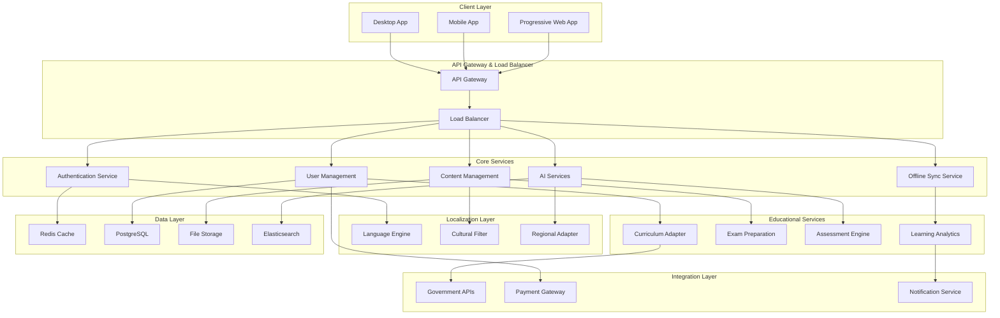

# Design Document: MindHangar AI for Bharat

## Overview

The MindHangar AI for Bharat platform is a comprehensive adaptation of the existing MindHangar student workspace, specifically engineered for the Indian education ecosystem. The design emphasizes cultural sensitivity, multi-language support, offline-first architecture, and integration with Indian educational standards.

The system follows a modular, microservices-based architecture that enables independent scaling of different components based on regional usage patterns. The design prioritizes accessibility, performance optimization for varying network conditions, and seamless integration with existing Indian educational infrastructure.

## Architecture

### High-Level Architecture



### Architectural Principles

1. **Offline-First Design**: All core functionality available without internet connectivity
2. **Progressive Enhancement**: Features gracefully degrade based on device capabilities and network conditions
3. **Microservices Architecture**: Independent, scalable services for different functional domains
4. **Cultural Abstraction**: Localization and cultural adaptation as cross-cutting concerns
5. **Performance Optimization**: Aggressive caching and content delivery optimization for Indian infrastructure

## Components and Interfaces

### 1. Language Engine

**Purpose**: Handles multi-language support, translation, and regional script processing.

**Key Interfaces**:
```typescript
interface LanguageEngine {
  translateText(text: string, targetLanguage: string): Promise<string>
  detectLanguage(text: string): Promise<string>
  convertScript(text: string, targetScript: string): Promise<string>
  processVoiceInput(audio: Blob, language: string): Promise<string>
  generateVoiceOutput(text: string, language: string, accent: string): Promise<Blob>
}
```

**Supported Languages**: Hindi, English, Tamil, Telugu, Bengali, Marathi, Gujarati, Kannada
**Scripts**: Devanagari, Tamil, Telugu, Bengali, Gujarati, Roman

### 2. Cultural Filter

**Purpose**: Ensures all AI responses and content are culturally appropriate for Indian contexts.

**Key Interfaces**:
```typescript
interface CulturalFilter {
  filterContent(content: string, region: string): Promise<FilteredContent>
  adaptExamples(examples: Example[], culturalContext: CulturalContext): Promise<Example[]>
  validateCulturalSensitivity(response: string): Promise<ValidationResult>
  getRegionalPreferences(region: string): Promise<RegionalPreferences>
}
```

**Cultural Adaptations**:
- Festival calendars and cultural dates
- Regional examples and case studies
- Appropriate color schemes and visual elements
- Cultural values alignment in AI responses

### 3. Curriculum Adapter

**Purpose**: Aligns content and assessments with Indian educational boards and standards.

**Key Interfaces**:
```typescript
interface CurriculumAdapter {
  getSubjects(board: EducationalBoard, grade: number): Promise<Subject[]>
  alignContent(content: Content, board: EducationalBoard): Promise<AlignedContent>
  generateSyllabus(board: EducationalBoard, grade: number, subject: string): Promise<Syllabus>
  mapCompetitiveExam(exam: CompetitiveExam): Promise<ExamMapping>
}
```

**Supported Boards**: CBSE, ICSE, Maharashtra State Board, Tamil Nadu State Board, Karnataka State Board, and others
**Competitive Exams**: JEE Main/Advanced, NEET, UPSC, CAT, GATE, State-level exams

### 4. Offline Sync Service

**Purpose**: Manages offline functionality and data synchronization.

**Key Interfaces**:
```typescript
interface OfflineSyncService {
  cacheEssentialContent(userId: string, preferences: UserPreferences): Promise<void>
  syncProgress(localData: ProgressData): Promise<SyncResult>
  detectConnectivity(): Promise<ConnectivityStatus>
  optimizeForBandwidth(content: Content, bandwidthLevel: BandwidthLevel): Promise<OptimizedContent>
}
```

**Offline Capabilities**:
- Core learning modules cached locally
- Progress tracking without internet
- Background synchronization when connected
- Intelligent content prioritization

### 5. Assessment Engine

**Purpose**: Generates culturally appropriate assessments and tracks learning progress.

**Key Interfaces**:
```typescript
interface AssessmentEngine {
  generateQuiz(topic: string, difficulty: Difficulty, examPattern: ExamPattern): Promise<Quiz>
  evaluateResponse(response: StudentResponse): Promise<Evaluation>
  trackProgress(userId: string, activity: LearningActivity): Promise<ProgressUpdate>
  generateMockTest(exam: CompetitiveExam, duration: number): Promise<MockTest>
}
```

**Assessment Features**:
- Board-specific question patterns
- Competitive exam simulation
- Adaptive difficulty adjustment
- Cultural context in questions

## Data Models

### User Profile Model

```typescript
interface UserProfile {
  id: string
  personalInfo: {
    name: string
    age: number
    preferredLanguage: string
    region: string
    culturalContext: CulturalContext
  }
  educationalInfo: {
    board: EducationalBoard
    grade: number
    subjects: string[]
    competitiveExams: CompetitiveExam[]
    medium: EducationMedium // English/Vernacular
  }
  preferences: {
    offlineMode: boolean
    lowBandwidthMode: boolean
    voiceEnabled: boolean
    gamificationLevel: GamificationLevel
  }
  progress: {
    completedModules: string[]
    currentStreak: number
    totalStudyTime: number
    examScores: ExamScore[]
  }
}
```

### Content Model

```typescript
interface LocalizedContent {
  id: string
  baseContent: {
    title: string
    description: string
    type: ContentType
    difficulty: Difficulty
    estimatedTime: number
  }
  localizations: {
    [language: string]: {
      title: string
      description: string
      content: string
      examples: Example[]
      culturalAdaptations: CulturalAdaptation[]
    }
  }
  curriculumAlignment: {
    boards: EducationalBoard[]
    grades: number[]
    subjects: string[]
    topics: string[]
  }
  accessibility: {
    offlineAvailable: boolean
    lowBandwidthVersion: string
    audioVersion?: string
    visualAids: VisualAid[]
  }
}
```

### Assessment Model

```typescript
interface CulturalAssessment {
  id: string
  metadata: {
    type: AssessmentType
    board: EducationalBoard
    subject: string
    topic: string
    difficulty: Difficulty
    estimatedTime: number
  }
  questions: {
    [language: string]: Question[]
  }
  culturalContext: {
    region: string
    examples: CulturalExample[]
    references: CulturalReference[]
  }
  scoring: {
    maxScore: number
    passingScore: number
    competitiveExamAlignment?: ExamAlignment
  }
}
```

Now I need to use the prework tool to analyze the acceptance criteria before writing the Correctness Properties section.

<function_calls>
<invoke name="prework">
<parameter name="featureName">mindhangar-ai-for-bharat

## Correctness Properties

*A property is a characteristic or behavior that should hold true across all valid executions of a system—essentially, a formal statement about what the system should do. Properties serve as the bridge between human-readable specifications and machine-verifiable correctness guarantees.*

### Property 1: Multi-Language Processing Consistency
*For any* supported Indian language (Hindi, Tamil, Telugu, Bengali, Marathi, Gujarati, Kannada, English), when a user inputs text or selects that language, the system should process the input correctly, translate UI elements appropriately, render the correct regional script, and maintain language consistency throughout the interaction.
**Validates: Requirements 1.1, 1.2, 1.3, 1.4**

### Property 2: Voice Processing Language Fidelity
*For any* supported Indian language, when voice input is provided or voice output is requested, the system should recognize speech accurately in that language and generate voice output with the appropriate regional accent and pronunciation.
**Validates: Requirements 1.5, 1.6**

### Property 3: Cultural Content Adaptation
*For any* educational content, examples, or AI responses, when displayed to a user from a specific Indian region, the system should prioritize Indian cultural contexts, use appropriate festivals and historical figures, and ensure cultural sensitivity aligned with Indian values.
**Validates: Requirements 1.7, 2.7, 4.1, 4.6, 8.2, 8.5, 8.6**

### Property 4: Curriculum Alignment Consistency
*For any* educational board (CBSE, ICSE, State boards) and grade level, when content is requested or recommendations are made, the system should align with the specific curriculum requirements and customize content accordingly.
**Validates: Requirements 2.1, 2.2**

### Property 5: Exam Pattern Compliance
*For any* competitive exam (JEE, NEET, UPSC) or quiz generation request, the system should create questions that follow exact Indian exam patterns, difficulty levels, and time constraints appropriate for that specific examination.
**Validates: Requirements 2.4, 9.2**

### Property 6: Offline-First Functionality
*For any* core learning feature, when internet connectivity is unavailable, the system should continue to function with cached content, track progress locally, and synchronize data when connectivity is restored.
**Validates: Requirements 3.1, 3.2, 7.5**

### Property 7: Bandwidth Optimization
*For any* content delivery, when low-bandwidth mode is active, the system should reduce data usage by at least 70%, prioritize text over multimedia, compress files automatically, and provide clear data usage indicators.
**Validates: Requirements 3.3, 3.4, 7.4, 7.6**

### Property 8: Responsive Interface Adaptation
*For any* device screen size (minimum 4-inch displays), the system should render a fully responsive interface, show appropriate progress indicators during loading, and provide meaningful error messages with retry options when content fails to load.
**Validates: Requirements 3.6, 3.7, 7.7**

### Property 9: Performance Under Network Constraints
*For any* network condition, when connection quality is poor (2G speeds), the system should load core functionality within 3 seconds, automatically switch to low-bandwidth mode, and implement effective caching strategies for frequently accessed content.
**Validates: Requirements 7.1, 7.2, 7.3**

### Property 10: AI Cultural Intelligence
*For any* AI-generated response or query processing, the system should recognize Indian names, places, and cultural references, understand Indian educational terminology, ask for clarification when uncertain about cultural context, and provide responses that align with Indian educational methodologies.
**Validates: Requirements 8.3, 8.4, 8.7**

### Property 11: Government Integration Compliance
*For any* government platform integration (DIKSHA, state portals), when accessing or syncing content, the system should maintain proper attribution, generate compatible reports, and sync progress appropriately when integration is available.
**Validates: Requirements 5.4, 5.5, 5.7**

### Property 12: Payment System Localization
*For any* payment transaction, the system should support Indian payment methods (UPI, net banking, digital wallets), display prices in INR format, and provide flexible subscription duration options familiar to Indian users.
**Validates: Requirements 6.2, 6.4, 6.6, 6.7**

### Property 13: Competitive Exam Analytics
*For any* competitive exam preparation activity, the system should provide detailed performance analytics comparing with national averages, track progress at subject and topic levels, and generate study plans that account for specific exam dates and syllabus requirements.
**Validates: Requirements 9.3, 9.4, 9.6**

### Property 14: Multi-Role Access Control
*For any* user role (student, parent, teacher), the system should provide appropriate dashboard access, send relevant progress notifications, support content assignment and tracking capabilities, and generate reports suitable for academic contexts.
**Validates: Requirements 10.1, 10.2, 10.3, 10.7**

### Property 15: Parental Control Effectiveness
*For any* parental control feature, the system should provide effective content filtering, time management controls, detect concerning usage patterns, and send appropriate alerts to registered guardians.
**Validates: Requirements 10.4, 10.5, 10.6**

## Error Handling

### Network Connectivity Errors
- **Graceful Degradation**: When network connectivity is lost, the system transitions smoothly to offline mode without data loss
- **Retry Mechanisms**: Failed network requests implement exponential backoff with user-friendly retry options
- **Bandwidth Adaptation**: Automatic detection of network quality with seamless switching between bandwidth modes
- **Sync Conflict Resolution**: When multiple devices sync conflicting data, the system prioritizes the most recent learning progress

### Language Processing Errors
- **Fallback Languages**: If translation fails for a specific language, the system falls back to English with clear indication
- **Script Rendering Issues**: Unsupported characters are handled gracefully with appropriate font substitution
- **Voice Recognition Failures**: Poor audio quality triggers clear error messages with suggestions for improvement
- **Cultural Context Uncertainty**: When cultural appropriateness is unclear, the system requests user clarification

### Content Delivery Errors
- **Missing Localized Content**: If content isn't available in the user's language, the system offers the closest available alternative
- **Curriculum Misalignment**: Content that doesn't match the selected board shows clear warnings and alternatives
- **Assessment Generation Failures**: If quiz generation fails, the system provides pre-cached questions as backup
- **Government API Failures**: Integration failures with government platforms degrade gracefully to local content

### Performance and Resource Errors
- **Memory Constraints**: On low-memory devices, the system reduces cached content and simplifies UI elements
- **Storage Limitations**: When local storage is full, the system intelligently removes least-used cached content
- **Processing Timeouts**: Long-running operations show progress indicators and allow user cancellation
- **Concurrent User Limits**: System load balancing prevents performance degradation during peak usage

## Testing Strategy

### Dual Testing Approach

The MindHangar AI for Bharat platform requires comprehensive testing that combines both unit testing and property-based testing to ensure correctness across the diverse Indian educational ecosystem.

**Unit Testing Focus:**
- Specific examples of cultural adaptations (e.g., festival calendar integration, regional color schemes)
- Integration points with government APIs (DIKSHA, state portals)
- Edge cases in language processing (mixed scripts, regional dialects)
- Error conditions in offline synchronization
- Payment gateway integration with specific Indian providers
- Accessibility compliance on various device sizes

**Property-Based Testing Focus:**
- Universal properties that hold across all supported languages and regions
- Comprehensive input coverage through randomization of cultural contexts
- Performance characteristics under varying network conditions
- Curriculum alignment across different educational boards
- AI response quality and cultural sensitivity at scale

### Property-Based Testing Configuration

**Testing Framework**: Use Hypothesis (Python) or fast-check (TypeScript) for property-based testing implementation
**Test Iterations**: Minimum 100 iterations per property test to account for the diversity of Indian contexts
**Test Tagging**: Each property test must include a comment referencing its design document property

**Example Test Tags:**
- **Feature: mindhangar-ai-for-bharat, Property 1: Multi-Language Processing Consistency**
- **Feature: mindhangar-ai-for-bharat, Property 3: Cultural Content Adaptation**
- **Feature: mindhangar-ai-for-bharat, Property 6: Offline-First Functionality**

### Cultural Testing Considerations

**Language Diversity Testing:**
- Generate random text in all 8 supported Indian languages
- Test script rendering across different regional writing systems
- Validate voice processing with various Indian accents and dialects
- Verify translation accuracy for educational terminology

**Cultural Context Testing:**
- Generate random cultural scenarios across different Indian regions
- Test AI responses for cultural sensitivity across diverse contexts
- Validate festival and cultural date integration for all regions
- Verify appropriate examples and case studies for different cultural backgrounds

**Educational System Testing:**
- Test curriculum alignment across CBSE, ICSE, and major state boards
- Generate random competitive exam scenarios (JEE, NEET, UPSC)
- Validate assessment patterns match official examination formats
- Test performance analytics across different educational contexts

### Infrastructure Testing

**Network Condition Simulation:**
- Test performance under simulated 2G, 3G, and 4G conditions
- Validate offline functionality with intermittent connectivity
- Test bandwidth optimization across different content types
- Verify graceful degradation under poor network conditions

**Device Compatibility Testing:**
- Test responsive design across screen sizes from 4-inch to desktop
- Validate PWA functionality on various mobile browsers
- Test performance on low-memory Android devices common in India
- Verify accessibility features across different device capabilities

### Integration Testing

**Government Platform Integration:**
- Test DIKSHA API integration with various content types
- Validate state portal connections where available
- Test SSO integration with government authentication systems
- Verify report generation compatibility with government tracking systems

**Payment System Testing:**
- Test integration with Razorpay, Paytm, PhonePe, and Google Pay
- Validate UPI, net banking, and digital wallet transactions
- Test prepaid recharge models and subscription flexibility
- Verify INR currency display and pricing tier accessibility

Each correctness property must be implemented as a single property-based test that validates the universal behavior across all valid inputs, ensuring the system works correctly for the diverse needs of Indian students, educators, and parents.