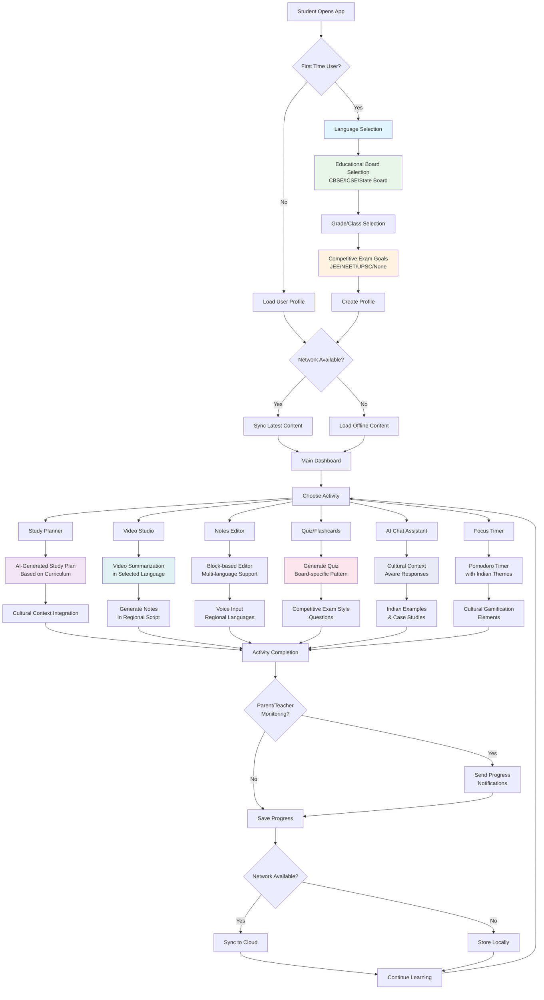

# Requirements Document: MindHangar AI for Bharat

## Introduction

MindHangar AI for Bharat is a comprehensive educational platform that combines the innovative features of the original MindHangar student workspace with specialized adaptations for the Indian education ecosystem. This platform democratizes AI-powered educational tools for Indian students across diverse linguistic, cultural, and socioeconomic backgrounds while preserving all core productivity features.

The platform integrates the original MindHangar's spatial workspace, AI-powered planning, video learning, block-based notes, cognitive training, and focus management with new Indian-specific features including multi-language support, cultural adaptation, curriculum alignment, and infrastructure optimization for the diverse needs of students from urban metros to rural villages.

## Use Case Flow Diagram

## Key User Journeys

### Journey 1: New Student Onboarding
1. **Language Selection**: Student chooses from 8+ Indian languages
2. **Educational Context Setup**: Selects board (CBSE/ICSE/State), grade, and exam goals
3. **Cultural Personalization**: System adapts interface and content to regional preferences
4. **Offline Preparation**: Downloads essential content for offline access

### Journey 2: Daily Learning Session
1. **Smart Dashboard**: Shows personalized recommendations based on curriculum and progress
2. **Multi-modal Learning**: Combines video, text, and interactive elements in chosen language
3. **AI-Powered Assistance**: Provides culturally aware help and explanations
4. **Progress Tracking**: Monitors learning with Indian educational context

### Journey 3: Competitive Exam Preparation
1. **Exam-Specific Mode**: Activates specialized interface for JEE/NEET/UPSC preparation
2. **Mock Tests**: Provides exam-pattern questions with time constraints
3. **Performance Analytics**: Compares with national averages and provides insights
4. **Adaptive Learning**: Adjusts difficulty based on performance patterns

### Journey 4: Low-Connectivity Learning
1. **Offline Detection**: Automatically switches to offline mode when connectivity is poor
2. **Content Prioritization**: Shows cached content and essential features
3. **Background Sync**: Uploads progress when connectivity improves
4. **Data Usage Awareness**: Provides clear indicators of data consumption

## Glossary

- **System**: The MindHangar AI for Bharat platform
- **User**: Students, educators, or parents using the platform
- **Content_Manager**: Component responsible for educational content delivery
- **Language_Engine**: Multi-language processing and translation system
- **Curriculum_Adapter**: Component that aligns content with Indian educational standards
- **Offline_Sync**: System for managing offline functionality and data synchronization
- **Cultural_Filter**: AI component ensuring culturally appropriate responses
- **Board**: Educational board (CBSE, ICSE, State boards)
- **Vernacular_Content**: Educational content in regional Indian languages
- **Low_Bandwidth_Mode**: Optimized interface for slow internet connections
- **Government_Integration**: Interface with Indian government educational platforms

## Requirements

### Requirement 1: Core MindHangar Features (Original Platform)

**User Story:** As a student, I want access to all original MindHangar productivity features, so that I can benefit from the proven spatial workspace and AI-powered learning tools.

#### Acceptance Criteria

1. THE System SHALL provide a unified spatial workspace with draggable, resizable panels
2. WHEN a user opens the application, THE System SHALL display the Studio layout with Planner, Notes, Video, Chat, and other panels
3. THE System SHALL support layout presets (Studio, Cinema, Research) for different learning contexts
4. WHEN a user interacts with panels, THE System SHALL maintain window-manager-like behavior with z-index management
5. THE System SHALL provide AI-powered roadmap generation using Google Gemini API
6. THE System SHALL support block-based note-taking with Notion-like functionality
7. THE System SHALL include quiz generation and flashcard creation for active recall
8. THE System SHALL provide focus timer with Pomodoro technique implementation
9. THE System SHALL support video embedding with AI summarization capabilities
10. THE System SHALL maintain user progress tracking and gamification elements

### Requirement 2: Multi-Language Support and Localization

**User Story:** As a student from any Indian state, I want to use the platform in my native language, so that I can learn more effectively without language barriers.

#### Acceptance Criteria

1. THE System SHALL support at least 8 major Indian languages (Hindi, English, Tamil, Telugu, Bengali, Marathi, Gujarati, Kannada)
2. WHEN a user selects a language, THE Language_Engine SHALL translate all UI elements and system messages to that language
3. WHEN a user inputs text in any supported Indian language, THE System SHALL process and respond appropriately in the same language
4. THE System SHALL support regional scripts (Devanagari, Tamil, Telugu, Bengali, Gujarati scripts)
5. WHEN voice input is used, THE System SHALL recognize and process speech in the selected Indian language
6. THE System SHALL provide voice output in the user's selected language with appropriate regional accent
7. WHEN displaying cultural references, THE Cultural_Filter SHALL ensure content is appropriate for the selected regional context
8. THE System SHALL support code-switching between languages within the same session
9. THE System SHALL maintain language consistency across all original MindHangar features
10. THE System SHALL provide language-specific fonts and proper text rendering for all supported scripts

### Requirement 3: Enhanced AI-Powered Learning (Original + Cultural Intelligence)

**User Story:** As an Indian student, I want AI assistance that understands both global educational concepts and Indian cultural context, so that learning feels relevant and personalized to my background.

#### Acceptance Criteria

1. THE System SHALL maintain all original AI features including roadmap generation, quiz creation, and content summarization
2. WHEN generating educational content, THE AI SHALL prioritize Indian examples, case studies, and cultural references
3. THE System SHALL provide AI-powered study schedule generation based on Indian academic calendars and exam dates
4. WHEN creating quizzes, THE System SHALL generate questions following Indian exam patterns and difficulty levels
5. THE AI SHALL understand Indian educational terminology and examination systems
6. WHEN processing queries, THE System SHALL recognize Indian names, places, and cultural references
7. THE System SHALL adapt AI personality to be respectful of Indian cultural norms and values
8. THE AI SHALL provide responses that align with Indian educational methodologies and teaching styles
9. WHEN uncertain about cultural context, THE System SHALL ask for clarification rather than assume
10. THE System SHALL integrate original MindHangar's AI coaching with cultural sensitivity filters

### Requirement 4: Spatial Workspace with Cultural Themes

**User Story:** As an Indian student, I want the spatial workspace to reflect my cultural identity while maintaining all productivity features, so that the learning environment feels familiar and engaging.

#### Acceptance Criteria

1. THE System SHALL preserve all original spatial workspace functionality including drag-and-drop panels
2. WHEN displaying the interface, THE System SHALL use Indian cultural color schemes (saffron, white, green)
3. THE System SHALL include Indian-themed visual elements like lotus motifs and rangoli patterns
4. WHEN showing calendar features, THE System SHALL integrate Indian festivals and important cultural dates
5. THE System SHALL adapt gamification elements to include Indian cultural themes and achievements
6. THE System SHALL maintain all original layout presets (Studio, Cinema, Research) with cultural styling
7. WHEN users interact with panels, THE System SHALL preserve window management behavior with cultural aesthetics
8. THE System SHALL support all original panel types (Planner, Notes, Video, Chat, Quiz, Focus, Settings) with localized content
9. THE System SHALL provide culturally appropriate icons and imagery throughout the interface
10. THE System SHALL maintain responsive design principles while incorporating Indian design elements

### Requirement 5: Indian Education System Integration

**User Story:** As a student preparing for Indian competitive exams, I want curriculum-aligned content and exam preparation tools integrated with the original MindHangar features, so that I can effectively prepare for my specific educational goals.

#### Acceptance Criteria

1. THE Curriculum_Adapter SHALL align content with CBSE, ICSE, and major state board curricula
2. WHEN a user selects their educational board, THE System SHALL customize content recommendations accordingly
3. THE System SHALL provide specialized preparation modules for competitive exams (JEE Main/Advanced, NEET, UPSC, CAT, GATE)
4. WHEN generating quizzes, THE System SHALL create questions following Indian exam patterns and difficulty levels
5. THE Content_Manager SHALL integrate with government educational platforms (DIKSHA, SWAYAM, PM eVIDYA)
6. THE System SHALL support vernacular medium education with content available in regional languages
7. WHEN displaying examples, THE System SHALL prioritize Indian case studies and culturally relevant scenarios
8. THE System SHALL maintain all original quiz and flashcard functionality while adding exam-specific patterns
9. THE System SHALL integrate competitive exam preparation with the original AI roadmap generation
10. THE System SHALL provide performance analytics comparing with national averages for Indian exams

### Requirement 6: Enhanced Block-Based Notes with Multi-Language Support

**User Story:** As an Indian student, I want to create notes in my preferred language using the original block-based editor, so that I can organize my thoughts naturally while maintaining the powerful editing features.

#### Acceptance Criteria

1. THE System SHALL preserve all original block-based note editing functionality
2. WHEN creating notes, THE System SHALL support input in any of the 8 supported Indian languages
3. THE System SHALL maintain all original block types (text, headings, todos, bullets, code) with multi-language support
4. WHEN switching languages, THE System SHALL preserve note structure and formatting
5. THE System SHALL support voice input for note creation in regional languages
6. THE System SHALL provide language-specific spell checking and auto-correction
7. WHEN organizing notes, THE System SHALL maintain the original drag-and-drop and slash command functionality
8. THE System SHALL support mixed-language content within the same note or block
9. THE System SHALL preserve all original note synchronization and storage features
10. THE System SHALL provide culturally appropriate templates and examples for note organization

### Requirement 7: Video Learning with Cultural Context

**User Story:** As an Indian student, I want to watch educational videos with AI summarization that understands Indian context, so that I can learn from both global and local educational content effectively.

#### Acceptance Criteria

1. THE System SHALL maintain all original video embedding and playback functionality
2. WHEN processing video content, THE AI SHALL generate summaries with Indian cultural context when relevant
3. THE System SHALL support videos in Indian languages with appropriate subtitle generation
4. WHEN displaying video recommendations, THE System SHALL prioritize content from Indian educators and institutions
5. THE System SHALL provide AI summaries that use Indian examples to explain global concepts
6. THE System SHALL maintain all original video panel features including note-taking integration
7. WHEN generating insights from videos, THE AI SHALL relate content to Indian curriculum and exam patterns
8. THE System SHALL support offline video caching for areas with limited internet connectivity
9. THE System SHALL provide culturally appropriate content filtering for educational videos
10. THE System SHALL integrate video learning with the original focus timer and progress tracking

### Requirement 8: Focus Management with Indian Themes

**User Story:** As an Indian student, I want focus and productivity tools that incorporate familiar cultural elements, so that I can maintain concentration while feeling connected to my heritage.

#### Acceptance Criteria

1. THE System SHALL preserve all original focus timer and Pomodoro technique functionality
2. WHEN starting focus sessions, THE System SHALL offer Indian-themed backgrounds and sounds (temple bells, nature sounds)
3. THE System SHALL integrate Indian festival calendars into study planning and break scheduling
4. WHEN providing focus guidance, THE System SHALL use culturally appropriate meditation and mindfulness techniques
5. THE System SHALL maintain all original distraction blocking and UI lock features
6. THE System SHALL provide focus session analytics with cultural context and regional comparisons
7. WHEN celebrating achievements, THE System SHALL use Indian cultural symbols and congratulatory messages
8. THE System SHALL support traditional Indian time management concepts alongside modern productivity techniques
9. THE System SHALL maintain integration with all other original features during focus sessions
10. THE System SHALL provide family-friendly focus modes that respect Indian household dynamics

**User Story:** As a student in a rural area with limited internet connectivity, I want to access educational content offline and with minimal data usage, so that I can continue learning despite infrastructure constraints.

#### Acceptance Criteria

1. THE System SHALL function in offline mode with core features available without internet connectivity
2. WHEN internet is available, THE Offline_Sync SHALL synchronize user progress and download new content
3. THE System SHALL provide a low-bandwidth mode that reduces data usage by at least 70%
4. WHEN in low-bandwidth mode, THE System SHALL prioritize text content over multimedia
5. THE System SHALL implement Progressive Web App (PWA) features for mobile-first access
6. THE System SHALL be fully responsive and optimized for smartphone screens (minimum 4-inch displays)
7. WHEN loading content, THE System SHALL show clear progress indicators and estimated data usage
8. THE System SHALL cache frequently accessed content locally for faster subsequent access

### Requirement 4: Cultural Adaptation and Content Localization

**User Story:** As an Indian student, I want educational content that reflects my cultural context and values, so that learning feels relevant and engaging to my background.

#### Acceptance Criteria

1. WHEN generating examples, THE Cultural_Filter SHALL use Indian contexts, festivals, historical figures, and geographical references
2. THE System SHALL adapt gamification elements to include Indian cultural themes and achievements
3. WHEN providing AI responses, THE Cultural_Filter SHALL ensure cultural sensitivity and appropriateness for Indian values
4. THE System SHALL include Indian traditional learning methods and pedagogical approaches
5. WHEN displaying calendar features, THE System SHALL include Indian festivals and important cultural dates
6. THE Content_Manager SHALL prioritize Indian authors, scientists, and historical figures in educational content
7. THE System SHALL adapt color schemes and visual elements to align with Indian aesthetic preferences

### Requirement 5: Government Platform Integration

**User Story:** As a student using government educational resources, I want seamless integration with official platforms, so that I can access all my educational tools in one place.

#### Acceptance Criteria

1. THE Government_Integration SHALL connect with DIKSHA platform for accessing government-approved content
2. WHEN available, THE System SHALL integrate with state-specific educational portals
3. THE System SHALL support single sign-on with government authentication systems where available
4. WHEN accessing government content, THE System SHALL maintain proper attribution and compliance
5. THE System SHALL sync progress with government learning management systems when possible
6. THE System SHALL comply with Indian data protection and privacy regulations
7. WHEN required, THE System SHALL generate reports compatible with government educational tracking systems

### Requirement 6: Payment and Monetization Adaptation

**User Story:** As an Indian user, I want to pay for premium features using familiar and accessible payment methods, so that I can upgrade my learning experience affordably.

#### Acceptance Criteria

1. THE System SHALL integrate with popular Indian payment gateways (Razorpay, Paytm, PhonePe, Google Pay)
2. WHEN processing payments, THE System SHALL support UPI, net banking, and digital wallets
3. THE System SHALL offer pricing tiers appropriate for Indian economic conditions
4. WHEN displaying prices, THE System SHALL show amounts in Indian Rupees (INR)
5. THE System SHALL provide free tiers with substantial functionality for accessibility
6. THE System SHALL support prepaid recharge models familiar to Indian users
7. WHEN offering subscriptions, THE System SHALL provide flexible duration options (monthly, quarterly, yearly)

### Requirement 7: Performance Optimization for Indian Infrastructure

**User Story:** As a user with varying internet speeds, I want the platform to perform well regardless of my connection quality, so that my learning experience remains smooth and uninterrupted.

#### Acceptance Criteria

1. THE System SHALL load core functionality within 3 seconds on 2G connections
2. WHEN network quality is poor, THE System SHALL automatically switch to low-bandwidth mode
3. THE System SHALL implement aggressive caching strategies for frequently accessed content
4. WHEN uploading content, THE System SHALL compress files automatically to reduce bandwidth usage
5. THE System SHALL provide offline-first architecture with background synchronization
6. THE System SHALL show clear indicators of network status and data usage
7. WHEN content fails to load, THE System SHALL provide meaningful error messages and retry options

### Requirement 8: AI Model Adaptation for Indian Context

**User Story:** As an Indian student, I want AI responses that understand my cultural context and educational system, so that the assistance I receive is relevant and accurate.

#### Acceptance Criteria

1. THE Cultural_Filter SHALL train AI models on Indian educational content and cultural contexts
2. WHEN generating responses, THE System SHALL prioritize Indian examples and case studies
3. THE System SHALL understand Indian educational terminology and examination patterns
4. WHEN processing queries, THE System SHALL recognize Indian names, places, and cultural references
5. THE System SHALL provide responses that align with Indian educational values and methodologies
6. THE System SHALL adapt AI personality to be respectful of Indian cultural norms
7. WHEN uncertain about cultural context, THE System SHALL ask for clarification rather than assume

### Requirement 9: Competitive Exam Preparation Features

**User Story:** As a student preparing for competitive exams, I want specialized tools and content for exam preparation, so that I can effectively compete in India's competitive educational landscape.

#### Acceptance Criteria

1. THE System SHALL provide dedicated modules for JEE Main, JEE Advanced, NEET, UPSC, and other major competitive exams
2. WHEN practicing questions, THE System SHALL follow exact exam patterns and time constraints
3. THE System SHALL provide detailed analytics comparing performance with national averages
4. WHEN generating study plans, THE System SHALL account for specific exam dates and syllabus requirements
5. THE System SHALL offer mock tests that simulate actual exam conditions
6. THE System SHALL provide subject-wise and topic-wise performance tracking for competitive exams
7. WHEN recommending study materials, THE System SHALL prioritize content from recognized Indian publishers and educators

### Requirement 10: Parental and Teacher Integration

**User Story:** As a parent or teacher, I want to monitor and support student progress, so that I can provide appropriate guidance and intervention when needed.

#### Acceptance Criteria

1. THE System SHALL provide parent/teacher dashboard with student progress visibility
2. WHEN students complete activities, THE System SHALL send progress notifications to registered guardians
3. THE System SHALL allow teachers to assign specific content and track class performance
4. WHEN concerning patterns are detected, THE System SHALL alert parents and teachers appropriately
5. THE System SHALL provide family-friendly content filtering and time management controls
6. THE System SHALL support multiple user roles (student, parent, teacher) with appropriate permissions
7. WHEN generating reports, THE System SHALL create formats suitable for parent-teacher meetings and academic reviews