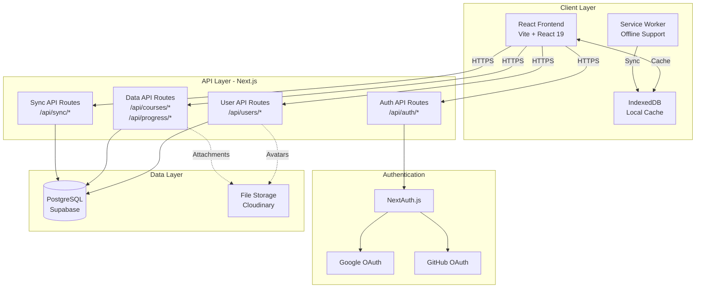
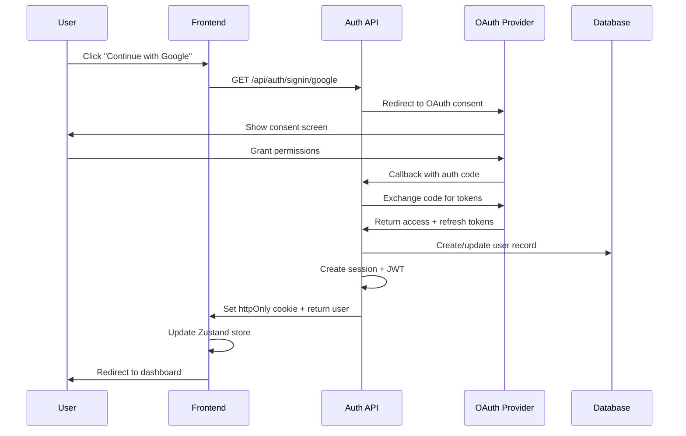
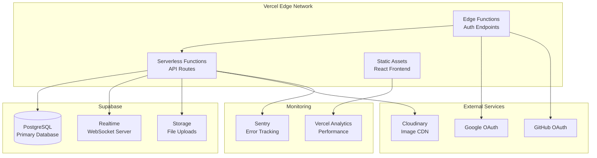

# Real Authentication & Backend Integration - Design Document

## 1. Overview

This design document outlines the architecture for replacing the mock authentication system with a production-ready OAuth-based authentication solution integrated with a backend API. The system will support Google and GitHub OAuth providers, implement secure session management, and provide RESTful APIs for user data persistence and synchronization across devices.

### 1.1 Design Goals

- **Security First**: Implement industry-standard OAuth 2.0 with secure token storage and session management
- **Seamless Migration**: Replace mock authentication with minimal disruption to existing frontend code
- **Scalability**: Design stateless APIs that can scale horizontally
- **Developer Experience**: Simple deployment to serverless platforms (Vercel, Netlify)
- **Data Sync**: Enable cross-device synchronization of user progress and preferences
- **Compliance**: Meet GDPR, COPPA, and Indian data protection requirements

### 1.2 Technology Stack Decisions

**Backend Framework**: Next.js API Routes
- **Rationale**: Already using React/Vite frontend; Next.js provides seamless full-stack development, built-in API routes, and excellent Vercel deployment support
- **Alternative Considered**: Express.js (more boilerplate, separate deployment)

**Authentication Library**: NextAuth.js v5
- **Rationale**: Industry-standard, supports multiple OAuth providers, handles token refresh, built for Next.js
- **Alternative Considered**: Passport.js (more manual configuration)

**Database**: PostgreSQL via Supabase
- **Rationale**: Relational data model fits user/course/progress structure, Supabase provides auth helpers, real-time subscriptions, and generous free tier
- **Alternative Considered**: MongoDB Atlas (less structured, but considered for flexibility)

**Session Storage**: Database-backed sessions with JWT tokens
- **Rationale**: Stateless JWT for API authentication, database sessions for OAuth state management
- **Alternative Considered**: Redis (additional infrastructure complexity)

**Deployment**: Vercel
- **Rationale**: Zero-config deployment for Next.js, edge functions, automatic HTTPS, environment variable management
- **Alternative Considered**: Netlify, Railway (similar capabilities)


## 2. System Architecture

### 2.1 High-Level Architecture



### 2.2 Authentication Flow



### 2.3 Component Architecture

**Frontend Components**:
- `AuthProvider`: Wraps app with NextAuth session context
- `LoginPage`: OAuth provider buttons, handles redirects
- `ProtectedRoute`: Guards routes requiring authentication
- `useAuth`: Custom hook for accessing auth state
- `authService`: API client for auth operations (replaces mock)

**Backend Components**:
- `NextAuth Configuration`: OAuth provider setup, callbacks, JWT strategy
- `Auth Middleware`: Validates JWT tokens, attaches user to request
- `Session Manager`: Creates, validates, refreshes sessions
- `User Controller`: CRUD operations for user data
- `Sync Controller`: Handles data synchronization logic


## 3. API Specifications

### 3.1 Authentication Endpoints

#### 3.1.1 Initiate OAuth Login
```
GET /api/auth/signin/:provider
```
**Parameters**:
- `provider`: "google" | "github"
- `callbackUrl` (query): URL to redirect after successful auth

**Response**: Redirects to OAuth provider consent screen

**Error Handling**:
- Invalid provider → 400 Bad Request
- OAuth provider unavailable → 503 Service Unavailable

---

#### 3.1.2 OAuth Callback
```
GET /api/auth/callback/:provider
```
**Parameters**:
- `code` (query): Authorization code from OAuth provider
- `state` (query): CSRF protection token

**Response**: 
```typescript
{
  user: {
    id: string;
    email: string;
    name: string;
    avatar: string;
    provider: "google" | "github";
  };
  accessToken: string; // JWT for API calls
  expiresAt: number; // Unix timestamp
}
```
Sets httpOnly cookie: `next-auth.session-token`

**Error Handling**:
- Invalid code → 401 Unauthorized
- State mismatch → 403 Forbidden (CSRF)
- Token exchange failure → 502 Bad Gateway

---

#### 3.1.3 Get Current Session
```
GET /api/auth/session
```
**Headers**: `Cookie: next-auth.session-token`

**Response**:
```typescript
{
  user: {
    id: string;
    email: string;
    name: string;
    avatar: string;
    provider: string;
    profile?: UserProfile; // After onboarding
  };
  expiresAt: number;
}
```

**Error Handling**:
- No session cookie → 401 Unauthorized
- Expired session → 401 Unauthorized (trigger refresh)

---

#### 3.1.4 Refresh Session
```
POST /api/auth/refresh
```
**Headers**: `Cookie: next-auth.session-token`

**Response**:
```typescript
{
  accessToken: string;
  expiresAt: number;
}
```

**Error Handling**:
- Invalid refresh token → 401 Unauthorized (force re-login)
- OAuth provider refresh failure → 502 Bad Gateway

---

#### 3.1.5 Logout
```
POST /api/auth/signout
```
**Headers**: `Cookie: next-auth.session-token`

**Response**: 
```typescript
{ success: true }
```
Clears session cookie

**Error Handling**:
- Always succeeds (idempotent)


### 3.2 User Management Endpoints

#### 3.2.1 Get User Profile
```
GET /api/users/me
```
**Headers**: `Authorization: Bearer <jwt_token>`

**Response**:
```typescript
{
  id: string;
  email: string;
  name: string;
  avatar: string;
  provider: string;
  profile?: {
    preferredLanguage: string;
    region: string;
    educationalBoard?: string;
    grade?: number;
    competitiveExams?: string[];
    culturalContext?: object;
  };
  createdAt: string;
  updatedAt: string;
}
```

**Error Handling**:
- No auth token → 401 Unauthorized
- Invalid token → 401 Unauthorized
- User not found → 404 Not Found

---

#### 3.2.2 Update User Profile
```
PATCH /api/users/me
```
**Headers**: `Authorization: Bearer <jwt_token>`

**Request Body**:
```typescript
{
  name?: string;
  profile?: {
    preferredLanguage?: string;
    region?: string;
    educationalBoard?: string;
    grade?: number;
    competitiveExams?: string[];
    culturalContext?: object;
  };
}
```

**Response**: Updated user object (same as GET /api/users/me)

**Validation**:
- `name`: 1-100 characters
- `preferredLanguage`: Must be in supported languages list
- `grade`: 1-12 or null
- `competitiveExams`: Array of valid exam codes

**Error Handling**:
- Validation failure → 400 Bad Request with field errors
- Unauthorized → 401 Unauthorized

---

#### 3.2.3 Delete User Account
```
DELETE /api/users/me
```
**Headers**: `Authorization: Bearer <jwt_token>`

**Response**:
```typescript
{ success: true, message: "Account deleted successfully" }
```

**Side Effects**:
- Deletes user record
- Deletes all associated data (courses, progress, notes)
- Invalidates all sessions
- Removes OAuth connection (user must revoke from provider)

**Error Handling**:
- Unauthorized → 401 Unauthorized
- Deletion failure → 500 Internal Server Error


### 3.3 Data Synchronization Endpoints

#### 3.3.1 Sync User Data
```
POST /api/sync
```
**Headers**: `Authorization: Bearer <jwt_token>`

**Request Body**:
```typescript
{
  lastSyncAt?: string; // ISO timestamp of last sync
  courses?: Course[]; // Local courses to sync
  progress?: Progress[]; // Local progress to sync
  notes?: Note[]; // Local notes to sync
  preferences?: Preferences; // Local preferences to sync
}
```

**Response**:
```typescript
{
  syncedAt: string; // ISO timestamp
  conflicts?: Conflict[]; // Data conflicts requiring resolution
  courses: Course[]; // Server courses (merged)
  progress: Progress[]; // Server progress (merged)
  notes: Note[]; // Server notes (merged)
  preferences: Preferences; // Server preferences (merged)
}
```

**Conflict Resolution Strategy**:
- **Last-Write-Wins**: For preferences and profile data
- **Merge**: For progress (take maximum progress)
- **Append**: For notes (keep both versions with timestamps)
- **Manual**: For courses (flag conflicts for user resolution)

**Error Handling**:
- Unauthorized → 401 Unauthorized
- Invalid data format → 400 Bad Request
- Sync conflict → 409 Conflict (with conflict details)

---

#### 3.3.2 Get Server Data
```
GET /api/sync?since=<timestamp>
```
**Headers**: `Authorization: Bearer <jwt_token>`

**Query Parameters**:
- `since` (optional): ISO timestamp to get changes since

**Response**:
```typescript
{
  courses: Course[];
  progress: Progress[];
  notes: Note[];
  preferences: Preferences;
  syncedAt: string;
}
```

**Error Handling**:
- Unauthorized → 401 Unauthorized
- Invalid timestamp → 400 Bad Request


### 3.4 Course & Progress Endpoints

#### 3.4.1 Get User Courses
```
GET /api/courses
```
**Headers**: `Authorization: Bearer <jwt_token>`

**Response**:
```typescript
{
  courses: Array<{
    id: string;
    title: string;
    description: string;
    level: string;
    videos: Array<{
      id: string;
      videoId: string;
      title: string;
      duration: number;
      completed: boolean;
    }>;
    progress: number; // 0-100
    createdAt: string;
    updatedAt: string;
  }>;
}
```

---

#### 3.4.2 Create Course
```
POST /api/courses
```
**Headers**: `Authorization: Bearer <jwt_token>`

**Request Body**:
```typescript
{
  title: string;
  description?: string;
  level: "beginner" | "intermediate" | "advanced" | "research";
  videos: Array<{
    videoId: string;
    title: string;
    duration?: number;
  }>;
}
```

**Response**: Created course object

---

#### 3.4.3 Update Progress
```
POST /api/progress
```
**Headers**: `Authorization: Bearer <jwt_token>`

**Request Body**:
```typescript
{
  courseId: string;
  videoId: string;
  completed: boolean;
  completedAt?: string;
}
```

**Response**:
```typescript
{
  success: true;
  progress: {
    courseId: string;
    completedVideos: number;
    totalVideos: number;
    percentage: number;
  };
}
```


## 4. Database Schema Design

### 4.1 Schema Overview

The database schema extends the existing SQLite schema to support authentication and cloud synchronization. We'll use PostgreSQL with Supabase for production.

### 4.2 Core Tables

#### 4.2.1 users Table (Extended)
```sql
CREATE TABLE users (
  id TEXT PRIMARY KEY,
  email TEXT UNIQUE NOT NULL,
  name TEXT NOT NULL,
  avatar TEXT,
  provider TEXT NOT NULL, -- 'google' | 'github'
  provider_id TEXT NOT NULL, -- OAuth provider's user ID
  
  -- Profile fields (from existing schema)
  preferred_language TEXT NOT NULL DEFAULT 'en',
  region TEXT NOT NULL DEFAULT 'north',
  educational_board TEXT,
  grade INTEGER,
  competitive_exams JSONB, -- Array of exam codes
  cultural_context JSONB,
  
  -- OAuth tokens (encrypted)
  access_token TEXT,
  refresh_token TEXT,
  token_expires_at TIMESTAMP,
  
  -- Metadata
  created_at TIMESTAMP NOT NULL DEFAULT NOW(),
  updated_at TIMESTAMP NOT NULL DEFAULT NOW(),
  last_login_at TIMESTAMP,
  
  -- Indexes
  CONSTRAINT unique_provider_user UNIQUE(provider, provider_id)
);

CREATE INDEX idx_users_email ON users(email);
CREATE INDEX idx_users_provider ON users(provider, provider_id);
```

#### 4.2.2 sessions Table
```sql
CREATE TABLE sessions (
  id TEXT PRIMARY KEY,
  user_id TEXT NOT NULL REFERENCES users(id) ON DELETE CASCADE,
  session_token TEXT UNIQUE NOT NULL,
  expires_at TIMESTAMP NOT NULL,
  
  -- Session metadata
  ip_address TEXT,
  user_agent TEXT,
  device_info JSONB,
  
  created_at TIMESTAMP NOT NULL DEFAULT NOW(),
  updated_at TIMESTAMP NOT NULL DEFAULT NOW()
);

CREATE INDEX idx_sessions_user_id ON sessions(user_id);
CREATE INDEX idx_sessions_token ON sessions(session_token);
CREATE INDEX idx_sessions_expires ON sessions(expires_at);
```

#### 4.2.3 courses Table (Extended)
```sql
CREATE TABLE courses (
  id TEXT PRIMARY KEY,
  user_id TEXT NOT NULL REFERENCES users(id) ON DELETE CASCADE,
  title TEXT NOT NULL,
  description TEXT,
  level TEXT NOT NULL, -- 'beginner' | 'intermediate' | 'advanced' | 'research'
  
  -- Sync metadata
  created_at TIMESTAMP NOT NULL DEFAULT NOW(),
  updated_at TIMESTAMP NOT NULL DEFAULT NOW(),
  synced_at TIMESTAMP,
  is_deleted BOOLEAN DEFAULT FALSE
);

CREATE INDEX idx_courses_user_id ON courses(user_id);
CREATE INDEX idx_courses_updated ON courses(updated_at);
```

#### 4.2.4 course_videos Table (Extended)
```sql
CREATE TABLE course_videos (
  id TEXT PRIMARY KEY,
  course_id TEXT NOT NULL REFERENCES courses(id) ON DELETE CASCADE,
  video_id TEXT NOT NULL, -- YouTube video ID
  title TEXT NOT NULL,
  duration INTEGER, -- seconds
  order_index INTEGER NOT NULL,
  transcript TEXT,
  
  created_at TIMESTAMP NOT NULL DEFAULT NOW()
);

CREATE INDEX idx_course_videos_course_id ON course_videos(course_id);
```

#### 4.2.5 user_progress Table (Extended)
```sql
CREATE TABLE user_progress (
  id TEXT PRIMARY KEY,
  user_id TEXT NOT NULL REFERENCES users(id) ON DELETE CASCADE,
  course_id TEXT NOT NULL REFERENCES courses(id) ON DELETE CASCADE,
  video_id TEXT NOT NULL,
  
  completed BOOLEAN NOT NULL DEFAULT FALSE,
  completed_at TIMESTAMP,
  
  -- Sync metadata
  created_at TIMESTAMP NOT NULL DEFAULT NOW(),
  updated_at TIMESTAMP NOT NULL DEFAULT NOW(),
  synced_at TIMESTAMP,
  
  CONSTRAINT unique_user_video UNIQUE(user_id, course_id, video_id)
);

CREATE INDEX idx_user_progress_user_id ON user_progress(user_id);
CREATE INDEX idx_user_progress_course_id ON user_progress(course_id);
```

#### 4.2.6 sync_log Table
```sql
CREATE TABLE sync_log (
  id TEXT PRIMARY KEY,
  user_id TEXT NOT NULL REFERENCES users(id) ON DELETE CASCADE,
  
  sync_type TEXT NOT NULL, -- 'full' | 'incremental'
  status TEXT NOT NULL, -- 'success' | 'partial' | 'failed'
  
  -- Sync statistics
  items_synced INTEGER DEFAULT 0,
  conflicts_detected INTEGER DEFAULT 0,
  errors JSONB,
  
  -- Timing
  started_at TIMESTAMP NOT NULL,
  completed_at TIMESTAMP,
  duration_ms INTEGER
);

CREATE INDEX idx_sync_log_user_id ON sync_log(user_id);
CREATE INDEX idx_sync_log_started ON sync_log(started_at);
```

### 4.3 Migration Strategy

**Phase 1**: Create new tables (sessions, sync_log)
**Phase 2**: Extend existing tables with OAuth fields
**Phase 3**: Migrate localStorage data to backend
**Phase 4**: Add indexes and optimize queries


## 5. Security Implementation

### 5.1 OAuth 2.0 Flow Security

**State Parameter**: 
- Generate cryptographically random state token for each OAuth request
- Store in session with 10-minute expiration
- Validate on callback to prevent CSRF attacks

**PKCE (Proof Key for Code Exchange)**:
- Generate code_verifier (random 43-128 character string)
- Create code_challenge = BASE64URL(SHA256(code_verifier))
- Send code_challenge with authorization request
- Send code_verifier with token exchange
- Prevents authorization code interception attacks

**Redirect URI Validation**:
- Whitelist allowed redirect URIs in OAuth provider settings
- Validate redirect_uri parameter matches whitelist
- Use exact string matching (no wildcards)

### 5.2 Token Management

**Access Token Storage**:
- Never store in localStorage or sessionStorage
- Store in httpOnly, secure, sameSite=strict cookies
- Set appropriate expiration (15 minutes)
- Encrypt at rest in database using AES-256-GCM

**Refresh Token Security**:
- Store encrypted in database only
- Never send to frontend
- Rotate on each use (refresh token rotation)
- Revoke all tokens on logout or password change

**JWT Structure**:
```typescript
{
  sub: string; // user ID
  email: string;
  name: string;
  provider: string;
  iat: number; // issued at
  exp: number; // expiration (15 min)
  jti: string; // JWT ID for revocation
}
```

**JWT Signing**:
- Algorithm: RS256 (asymmetric)
- Private key stored in environment variable
- Public key for verification
- Key rotation every 90 days

### 5.3 Session Security

**Cookie Configuration**:
```typescript
{
  httpOnly: true, // No JavaScript access
  secure: true, // HTTPS only
  sameSite: 'strict', // CSRF protection
  maxAge: 7 * 24 * 60 * 60, // 7 days
  path: '/',
  domain: process.env.COOKIE_DOMAIN
}
```

**Session Validation**:
- Verify session token on every request
- Check expiration timestamp
- Validate user still exists and is active
- Rate limit: 100 requests/minute per session

**Session Invalidation**:
- On logout: Delete session from database
- On token refresh failure: Delete session
- On suspicious activity: Delete all user sessions
- Automatic cleanup: Delete expired sessions daily

### 5.4 API Security

**Authentication Middleware**:
```typescript
async function authenticate(req, res, next) {
  // 1. Extract JWT from Authorization header or cookie
  const token = extractToken(req);
  
  // 2. Verify JWT signature and expiration
  const payload = await verifyJWT(token);
  
  // 3. Check if session exists and is valid
  const session = await db.sessions.findByToken(token);
  if (!session || session.expiresAt < new Date()) {
    throw new UnauthorizedError();
  }
  
  // 4. Attach user to request
  req.user = await db.users.findById(payload.sub);
  
  next();
}
```

**Rate Limiting**:
- Per IP: 100 requests/minute
- Per user: 1000 requests/hour
- Auth endpoints: 10 requests/minute
- Use sliding window algorithm
- Store in Redis or in-memory cache

**Input Validation**:
- Validate all inputs with Zod schemas
- Sanitize HTML inputs to prevent XSS
- Parameterized queries to prevent SQL injection
- Maximum request body size: 1MB

**CORS Configuration**:
```typescript
{
  origin: process.env.FRONTEND_URL,
  credentials: true,
  methods: ['GET', 'POST', 'PATCH', 'DELETE'],
  allowedHeaders: ['Content-Type', 'Authorization'],
  maxAge: 86400 // 24 hours
}
```

### 5.5 Data Protection

**Encryption at Rest**:
- OAuth tokens: AES-256-GCM with unique IV per record
- Sensitive user data: Field-level encryption
- Database backups: Encrypted with separate key

**Encryption in Transit**:
- TLS 1.3 for all connections
- HSTS header: max-age=31536000; includeSubDomains
- Certificate pinning for mobile apps

**Data Minimization**:
- Only request necessary OAuth scopes
- Delete unused data after 90 days
- Anonymize analytics data

**Audit Logging**:
- Log all authentication events
- Log data access and modifications
- Log security events (failed logins, token refresh)
- Retain logs for 1 year
- Store in separate secure logging service


## 6. Data Synchronization Design

### 6.1 Sync Strategy

**Hybrid Approach**: Combine optimistic updates with eventual consistency

**Sync Triggers**:
1. **On Login**: Full sync to get latest server state
2. **On Network Reconnect**: Incremental sync of offline changes
3. **Periodic**: Background sync every 5 minutes (if online)
4. **On User Action**: Immediate sync for critical data (progress, profile)

### 6.2 Conflict Resolution

**Conflict Detection**:
```typescript
interface Conflict {
  type: 'course' | 'progress' | 'note' | 'preference';
  itemId: string;
  localVersion: any;
  serverVersion: any;
  localUpdatedAt: string;
  serverUpdatedAt: string;
}
```

**Resolution Strategies**:

1. **Progress Data** (Last-Write-Wins with Max):
   - Compare timestamps
   - Take maximum progress value
   - Preserve both completion timestamps

2. **Courses** (Manual Resolution):
   - Flag conflict for user
   - Show both versions
   - Let user choose or merge

3. **Notes** (Append Both):
   - Keep both versions
   - Add conflict marker
   - User can manually merge later

4. **Preferences** (Last-Write-Wins):
   - Use most recent timestamp
   - Server wins on tie

### 6.3 Offline Support

**Offline Queue**:
```typescript
interface OfflineAction {
  id: string;
  type: 'create' | 'update' | 'delete';
  resource: 'course' | 'progress' | 'note';
  data: any;
  timestamp: string;
  retryCount: number;
}
```

**Sync Process**:
1. Store actions in IndexedDB queue
2. On reconnect, process queue in order
3. Retry failed actions with exponential backoff
4. Mark actions as synced or failed
5. Show sync status to user

**Optimistic Updates**:
- Update UI immediately
- Queue action for sync
- Rollback on sync failure
- Show sync indicator

### 6.4 Real-Time Updates (Future Enhancement)

**WebSocket Connection**:
- Connect on login
- Subscribe to user's data channel
- Receive real-time updates from other devices
- Merge updates into local state

**Server-Sent Events (SSE)** (Alternative):
- Simpler than WebSocket
- One-way server-to-client
- Automatic reconnection
- Good for progress updates


## 7. Deployment Architecture

### 7.1 Infrastructure Overview



### 7.2 Environment Configuration

**Development**:
```env
NODE_ENV=development
NEXTAUTH_URL=http://localhost:3000
NEXTAUTH_SECRET=dev_secret_key_change_in_production

# OAuth Providers
GOOGLE_CLIENT_ID=dev_google_client_id
GOOGLE_CLIENT_SECRET=dev_google_client_secret
GITHUB_CLIENT_ID=dev_github_client_id
GITHUB_CLIENT_SECRET=dev_github_client_secret

# Database
DATABASE_URL=postgresql://localhost:5432/mindhangar_dev
DIRECT_URL=postgresql://localhost:5432/mindhangar_dev

# Frontend
NEXT_PUBLIC_API_URL=http://localhost:3000/api
```

**Production**:
```env
NODE_ENV=production
NEXTAUTH_URL=https://mindhangar.in
NEXTAUTH_SECRET=<generated_secret_256_bits>

# OAuth Providers (Production credentials)
GOOGLE_CLIENT_ID=<production_google_client_id>
GOOGLE_CLIENT_SECRET=<production_google_client_secret>
GITHUB_CLIENT_ID=<production_github_client_id>
GITHUB_CLIENT_SECRET=<production_github_client_secret>

# Database (Supabase)
DATABASE_URL=<supabase_connection_pooler_url>
DIRECT_URL=<supabase_direct_connection_url>

# Frontend
NEXT_PUBLIC_API_URL=https://mindhangar.in/api

# Security
JWT_SIGNING_KEY=<rsa_private_key>
ENCRYPTION_KEY=<aes_256_key>

# Monitoring
SENTRY_DSN=<sentry_dsn>
SENTRY_AUTH_TOKEN=<sentry_auth_token>
```

### 7.3 Deployment Process

**Automated Deployment** (via Vercel):
1. Push to `main` branch
2. Vercel triggers build
3. Run database migrations
4. Build Next.js app
5. Deploy to edge network
6. Run smoke tests
7. Update DNS if needed

**Database Migrations**:
```bash
# Generate migration
npm run db:generate

# Apply migration (staging)
npm run db:migrate:staging

# Apply migration (production)
npm run db:migrate:production
```

**Rollback Strategy**:
- Vercel instant rollback to previous deployment
- Database migrations: Keep backward compatible for 1 version
- Feature flags for gradual rollout

### 7.4 Scaling Considerations

**Horizontal Scaling**:
- Vercel automatically scales serverless functions
- Database connection pooling (Supabase Pooler)
- Stateless API design (no server-side sessions)

**Caching Strategy**:
- CDN caching for static assets (1 year)
- API response caching (5 minutes for user data)
- Database query caching (Redis for hot data)

**Performance Targets**:
- API response time: < 200ms (p95)
- Database query time: < 50ms (p95)
- Frontend load time: < 2s (p95)
- Time to Interactive: < 3s (p95)


## 8. Error Handling & Edge Cases

### 8.1 OAuth Error Scenarios

**Provider Unavailable**:
- **Detection**: OAuth redirect fails or times out
- **Handling**: Show user-friendly error message, suggest trying again or alternative provider
- **Logging**: Log provider downtime for monitoring
- **Fallback**: None (OAuth is primary auth method)

**User Denies Consent**:
- **Detection**: OAuth callback with error=access_denied
- **Handling**: Redirect to login with message "Authentication cancelled"
- **Logging**: Log denial (not an error)
- **Retry**: Allow user to try again

**Invalid OAuth State**:
- **Detection**: State parameter mismatch on callback
- **Handling**: Reject request with 403 Forbidden
- **Logging**: Log as potential CSRF attack
- **Security**: Rate limit IP, alert if repeated

**Token Exchange Failure**:
- **Detection**: OAuth provider returns error on token exchange
- **Handling**: Show error, log details, suggest retry
- **Logging**: Log full error response for debugging
- **Retry**: Allow immediate retry

**Email Not Provided**:
- **Detection**: OAuth provider doesn't return email
- **Handling**: Request email scope explicitly, or reject signup
- **Logging**: Log provider and scopes requested
- **Fallback**: Ask user to provide email manually (future)

### 8.2 Session Management Errors

**Expired Session**:
- **Detection**: Session token expired or not found
- **Handling**: Attempt token refresh, if fails redirect to login
- **User Experience**: Seamless refresh, no interruption
- **Logging**: Log refresh attempts and failures

**Concurrent Sessions**:
- **Detection**: User logs in from multiple devices
- **Handling**: Allow multiple sessions (default), or implement single-session mode
- **Configuration**: Make configurable per user preference
- **Security**: Monitor for suspicious concurrent sessions

**Session Hijacking Attempt**:
- **Detection**: Session used from different IP/user-agent
- **Handling**: Invalidate session, require re-authentication
- **Logging**: Log as security event, alert user via email
- **Prevention**: Bind session to IP range and user-agent

### 8.3 Data Sync Errors

**Network Timeout**:
- **Detection**: API request exceeds timeout (10s)
- **Handling**: Queue action for retry, show offline indicator
- **Retry**: Exponential backoff (1s, 2s, 4s, 8s, 16s)
- **User Feedback**: "Syncing..." indicator

**Sync Conflict**:
- **Detection**: Server data newer than local data
- **Handling**: Apply conflict resolution strategy (see section 6.2)
- **User Notification**: Show conflict resolution UI if manual resolution needed
- **Logging**: Log conflicts for analysis

**Data Validation Failure**:
- **Detection**: Server rejects data due to validation error
- **Handling**: Show validation errors to user, don't queue for retry
- **User Action**: User must fix data and retry
- **Logging**: Log validation errors

**Partial Sync Failure**:
- **Detection**: Some items sync successfully, others fail
- **Handling**: Mark successful items as synced, retry failed items
- **User Feedback**: Show "Partially synced" status
- **Retry**: Retry failed items only

### 8.4 Database Errors

**Connection Pool Exhausted**:
- **Detection**: Database connection timeout
- **Handling**: Queue request, wait for available connection
- **Monitoring**: Alert if pool consistently full
- **Scaling**: Increase pool size or add read replicas

**Query Timeout**:
- **Detection**: Query exceeds timeout (5s)
- **Handling**: Cancel query, return 504 Gateway Timeout
- **Logging**: Log slow queries for optimization
- **Prevention**: Add indexes, optimize queries

**Unique Constraint Violation**:
- **Detection**: Duplicate key error
- **Handling**: Return 409 Conflict with clear message
- **User Action**: User must choose different value
- **Example**: Email already registered

**Foreign Key Violation**:
- **Detection**: Referenced record doesn't exist
- **Handling**: Return 400 Bad Request with details
- **Prevention**: Validate references before insert
- **Example**: Course ID doesn't exist

### 8.5 Rate Limiting

**Rate Limit Exceeded**:
- **Detection**: User exceeds request quota
- **Handling**: Return 429 Too Many Requests with Retry-After header
- **User Feedback**: "Too many requests, please wait"
- **Logging**: Log rate limit violations
- **Mitigation**: Implement exponential backoff on client

**DDoS Attack**:
- **Detection**: Abnormal traffic pattern from IP range
- **Handling**: Temporary IP ban, CAPTCHA challenge
- **Monitoring**: Alert security team
- **Mitigation**: Use Vercel's DDoS protection

### 8.6 Edge Cases

**User Deletes Account During Active Session**:
- **Handling**: Invalidate all sessions immediately
- **API Response**: 401 Unauthorized for subsequent requests
- **User Experience**: Redirect to login with "Account deleted" message

**OAuth Provider Changes User Email**:
- **Detection**: Email mismatch on login
- **Handling**: Update email in database, log change
- **Security**: Send notification to old email
- **Conflict**: If new email exists, require manual resolution

**User Switches OAuth Provider**:
- **Scenario**: User previously logged in with Google, now uses GitHub
- **Handling**: Link accounts if emails match, or create separate account
- **User Choice**: Ask user if they want to link accounts
- **Data**: Merge data if accounts linked

**Offline for Extended Period**:
- **Scenario**: User offline for days/weeks
- **Handling**: Full sync on reconnect, may take longer
- **User Feedback**: Show progress bar for sync
- **Optimization**: Sync in batches, prioritize recent data

**Browser Clears Cookies**:
- **Detection**: No session cookie on request
- **Handling**: Treat as logged out, redirect to login
- **User Experience**: Seamless re-login via OAuth
- **Data**: All data preserved on server


## 9. Correctness Properties

### 9.1 What Are Correctness Properties?

A property is a characteristic or behavior that should hold true across all valid executions of a system—essentially, a formal statement about what the system should do. Properties serve as the bridge between human-readable specifications and machine-verifiable correctness guarantees.

In this authentication system, properties help us verify that OAuth flows work correctly for all users, sessions persist reliably, data syncs without loss, and security measures protect against all attack vectors. Each property below can be tested using property-based testing frameworks that generate many random inputs to verify the property holds universally.

### 9.2 Authentication Properties

**Property 1: OAuth Redirect Contains Required Parameters**
*For any* OAuth provider (Google, GitHub) and any valid callback URL, initiating OAuth login should generate a redirect URL containing client_id, redirect_uri, scope, state, and response_type parameters.
**Validates: Requirements 2.1.1, 2.2.1**

**Property 2: Valid Authorization Code Produces Session**
*For any* valid OAuth authorization code, the token exchange process should successfully create a user session with a valid JWT token and session cookie.
**Validates: Requirements 2.1.2, 2.2.2, FR-3.1.3, FR-3.2.1**

**Property 3: OAuth User Info Contains Required Fields**
*For any* successful OAuth authentication, the retrieved user profile should contain non-empty name, email, and avatar fields.
**Validates: Requirements 2.1.3, 2.2.3**

**Property 4: Session Persistence Across Requests**
*For any* valid session token, making multiple requests with that token should return consistent user data until the session expires.
**Validates: Requirements 2.1.4, 2.2.4**

**Property 5: Logout Invalidates Session**
*For any* active session, calling the logout endpoint should invalidate the session token such that subsequent requests with that token return 401 Unauthorized.
**Validates: Requirements 2.1.5, 2.2.5, FR-3.2.5**

**Property 6: Token Refresh Generates New Valid Token**
*For any* valid refresh token, calling the refresh endpoint should return a new access token that is accepted by protected endpoints, and the old access token should be invalidated.
**Validates: Requirements FR-3.1.5**

**Property 7: Invalid OAuth Responses Return Appropriate Errors**
*For any* invalid OAuth callback (missing code, invalid state, expired code), the system should return an appropriate HTTP error code (400, 401, or 403) with a descriptive error message.
**Validates: Requirements FR-3.1.6**

### 9.3 Security Properties

**Property 8: Session Cookies Have Security Attributes**
*For any* successful authentication, the Set-Cookie header should include httpOnly, secure, and sameSite=strict attributes.
**Validates: Requirements 2.3.1, NFR-4.1.3**

**Property 9: Sensitive Data Encrypted at Rest**
*For any* user record stored in the database, OAuth tokens (access_token, refresh_token) should be encrypted such that the stored value is not equal to the plaintext value.
**Validates: Requirements 2.3.2, FR-3.1.4**

**Property 10: Sessions Expire After Configured Duration**
*For any* session created with a specific expiration time, requests made after that expiration time should return 401 Unauthorized.
**Validates: Requirements 2.3.3, FR-3.2.3**

**Property 11: Remember Me Extends Session Duration**
*For any* authentication with rememberMe=true, the session expiration should be 30 days, and for rememberMe=false, it should be 7 days.
**Validates: Requirements FR-3.2.4**

**Property 12: Revoked OAuth Tokens Handled Gracefully**
*For any* OAuth token that has been revoked by the provider, API requests using that token should fail with 401 Unauthorized and trigger a re-authentication flow.
**Validates: Requirements 2.3.4**

**Property 13: CORS Allows Only Whitelisted Origins**
*For any* API request, if the Origin header matches the whitelist, the response should include Access-Control-Allow-Origin header; otherwise, the request should be rejected.
**Validates: Requirements NFR-4.1.2**

**Property 14: CSRF Tokens Validated**
*For any* state-changing request (POST, PATCH, DELETE), if the CSRF token is missing or invalid, the request should return 403 Forbidden.
**Validates: Requirements NFR-4.1.4**

**Property 15: Malicious Input Sanitized**
*For any* user input containing XSS payloads (script tags, event handlers) or SQL injection attempts, the input should be either escaped or rejected with a 400 Bad Request error.
**Validates: Requirements NFR-4.1.5**

**Property 16: Rate Limit Enforced**
*For any* IP address or user, making more than 100 requests per minute should result in subsequent requests returning 429 Too Many Requests with a Retry-After header.
**Validates: Requirements FR-3.4.5, NFR-4.1.6**

**Property 17: Security Events Logged**
*For any* security-relevant event (failed login, token refresh, session invalidation), an entry should be created in the audit log with timestamp, user ID, event type, and relevant details.
**Validates: Requirements NFR-4.1.7**

### 9.4 User Management Properties

**Property 18: First Login Creates User Record**
*For any* new OAuth user ID (not previously seen), successful authentication should create a new user record in the database with the OAuth provider's user information.
**Validates: Requirements FR-3.3.1**

**Property 19: Profile Update Persists Changes**
*For any* authenticated user and valid profile update data, calling PATCH /api/users/me should update the user record such that subsequent GET /api/users/me returns the updated data.
**Validates: Requirements FR-3.3.2**

**Property 20: Profile Retrieval Returns Current User Data**
*For any* authenticated user, calling GET /api/users/me should return that user's data and not any other user's data.
**Validates: Requirements FR-3.3.3**

**Property 21: Profile Completion Marks User Onboarded**
*For any* user with incomplete profile, updating all required profile fields (preferredLanguage, region, grade) should mark the user as having completed onboarding.
**Validates: Requirements FR-3.3.4**

**Property 22: Account Deletion Removes All User Data**
*For any* authenticated user, calling DELETE /api/users/me should remove the user record and all associated data (courses, progress, notes, sessions) from the database.
**Validates: Requirements FR-3.3.5, NFR-4.5.1**

**Property 23: Data Export Returns Complete User Data**
*For any* authenticated user, requesting data export should return a structured file containing all user data (profile, courses, progress, notes, preferences) in JSON format.
**Validates: Requirements FR-3.5.3, NFR-4.5.1**

### 9.5 Data Synchronization Properties

**Property 24: Cross-Device Data Consistency**
*For any* user logged in on two different sessions, data synced from session A should be retrievable from session B after calling the sync endpoint.
**Validates: Requirements 2.4.1**

**Property 25: Updates Propagate Across Sessions**
*For any* user with multiple active sessions, updating data (course progress, notes) in session A should be visible in session B after syncing.
**Validates: Requirements 2.4.2**

**Property 26: Offline Actions Sync on Reconnect**
*For any* set of actions queued while offline, calling the sync endpoint should process all queued actions and mark them as synced.
**Validates: Requirements 2.4.3**

**Property 27: Sync Conflict Resolution Preserves Data**
*For any* sync conflict between local and server data, the conflict resolution strategy should preserve both versions or merge them such that no data is lost without user awareness.
**Validates: Requirements 2.4.1, 2.4.2**

**Property 28: Progress Sync Uses Maximum Value**
*For any* course progress conflict, the sync should take the maximum progress value from local and server, ensuring progress never decreases.
**Validates: Requirements 2.4.2**

### 9.6 API Correctness Properties

**Property 29: Course CRUD Operations Work Correctly**
*For any* authenticated user, creating a course should make it retrievable via GET /api/courses, updating it should persist changes, and deleting it should remove it from the list.
**Validates: Requirements FR-3.4.2**

**Property 30: Preferences Persist and Retrieve Correctly**
*For any* authenticated user and valid preferences object, updating preferences should persist such that subsequent retrieval returns the same preferences.
**Validates: Requirements FR-3.4.3**

**Property 31: Cached Responses Match Fresh Responses**
*For any* cacheable endpoint, the first request should return data from the database, and subsequent requests within the cache TTL should return identical data without hitting the database.
**Validates: Requirements NFR-4.2.4**


## 10. Testing Strategy

### 10.1 Testing Approach

We will implement a dual testing approach combining unit tests and property-based tests:

**Unit Tests**: Focus on specific examples, edge cases, and error conditions
- OAuth callback with specific error codes
- Session expiration at exact timestamps
- Conflict resolution for specific data scenarios
- Integration between components

**Property-Based Tests**: Verify universal properties across all inputs
- OAuth flows work for any valid credentials
- Sessions persist for any user
- Data syncs correctly for any dataset
- Security measures protect against any attack vector

Together, these approaches provide comprehensive coverage: unit tests catch concrete bugs in specific scenarios, while property tests verify general correctness across the entire input space.

### 10.2 Property-Based Testing Configuration

**Testing Library**: We will use **fast-check** for TypeScript/JavaScript property-based testing.

**Test Configuration**:
- Minimum 100 iterations per property test (due to randomization)
- Each property test must reference its design document property
- Tag format: `Feature: real-authentication-backend, Property {number}: {property_text}`

**Example Property Test Structure**:
```typescript
import fc from 'fast-check';

describe('Feature: real-authentication-backend', () => {
  it('Property 1: OAuth Redirect Contains Required Parameters', () => {
    fc.assert(
      fc.property(
        fc.constantFrom('google', 'github'),
        fc.webUrl(),
        (provider, callbackUrl) => {
          const redirectUrl = generateOAuthRedirect(provider, callbackUrl);
          const url = new URL(redirectUrl);
          
          expect(url.searchParams.has('client_id')).toBe(true);
          expect(url.searchParams.has('redirect_uri')).toBe(true);
          expect(url.searchParams.has('scope')).toBe(true);
          expect(url.searchParams.has('state')).toBe(true);
          expect(url.searchParams.has('response_type')).toBe(true);
        }
      ),
      { numRuns: 100 }
    );
  });
});
```

### 10.3 Unit Testing Strategy

**Test Coverage Goals**:
- Authentication flows: 90%+ coverage
- API endpoints: 85%+ coverage
- Security middleware: 95%+ coverage
- Data sync logic: 85%+ coverage

**Key Unit Test Areas**:

1. **OAuth Flow Tests**:
   - Test specific OAuth error codes (access_denied, invalid_grant)
   - Test state parameter validation
   - Test token exchange with mock OAuth provider
   - Test callback URL validation

2. **Session Management Tests**:
   - Test session creation with specific expiration times
   - Test session refresh with expired tokens
   - Test concurrent session handling
   - Test session invalidation on logout

3. **API Endpoint Tests**:
   - Test each endpoint with valid inputs
   - Test validation errors with invalid inputs
   - Test authentication middleware
   - Test rate limiting with specific request counts

4. **Data Sync Tests**:
   - Test conflict resolution with specific scenarios
   - Test offline queue processing
   - Test partial sync failures
   - Test data merge strategies

5. **Security Tests**:
   - Test CSRF protection with missing/invalid tokens
   - Test XSS prevention with specific payloads
   - Test SQL injection prevention
   - Test cookie security attributes

6. **Error Handling Tests**:
   - Test database connection failures
   - Test OAuth provider timeouts
   - Test network errors during sync
   - Test validation errors

### 10.4 Integration Testing

**Test Scenarios**:
1. Complete OAuth flow from login to authenticated API call
2. User registration, profile completion, and data sync
3. Multi-device sync with conflict resolution
4. Session expiration and token refresh
5. Account deletion and data cleanup

**Testing Tools**:
- **Vitest**: Test runner (already in project)
- **fast-check**: Property-based testing
- **Supertest**: API endpoint testing
- **MSW (Mock Service Worker)**: Mock OAuth providers
- **Testcontainers**: PostgreSQL for integration tests

### 10.5 Security Testing

**Automated Security Tests**:
- OWASP Top 10 vulnerability scanning
- Dependency vulnerability scanning (npm audit)
- CSRF token validation tests
- XSS payload injection tests
- SQL injection attempt tests
- Rate limiting stress tests

**Manual Security Review**:
- OAuth implementation review
- Token storage and encryption review
- Session management review
- CORS configuration review
- Input validation review

### 10.6 Performance Testing

**Load Testing** (using Artillery or k6):
- 1000 concurrent users
- 100 requests/second sustained
- Measure p50, p95, p99 response times
- Identify bottlenecks

**Stress Testing**:
- Gradually increase load until failure
- Identify breaking point
- Test recovery after overload

**Endurance Testing**:
- Run at normal load for 24 hours
- Check for memory leaks
- Monitor database connection pool

### 10.7 Test Data Management

**Test Data Generation**:
- Use fast-check arbitraries for random data
- Create realistic user profiles
- Generate varied course and progress data
- Include edge cases (empty strings, max lengths, special characters)

**Test Database**:
- Use separate test database
- Reset database between test suites
- Use transactions for test isolation
- Seed with realistic data for integration tests

### 10.8 Continuous Integration

**CI Pipeline** (GitHub Actions):
1. Run linter and type checker
2. Run unit tests with coverage
3. Run property-based tests
4. Run integration tests
5. Run security scans
6. Build application
7. Deploy to staging (on main branch)

**Quality Gates**:
- All tests must pass
- Code coverage > 80%
- No critical security vulnerabilities
- No TypeScript errors
- Linter passes


## 11. Migration from Mock to Real Authentication

### 11.1 Migration Strategy

The migration will be done in phases to minimize risk and ensure smooth transition:

**Phase 1: Backend Setup** (Week 1)
- Set up Next.js API routes project
- Configure NextAuth.js with OAuth providers
- Set up Supabase database
- Implement authentication endpoints
- Deploy to staging environment

**Phase 2: Frontend Integration** (Week 2)
- Create new `authService` implementation (real API)
- Keep mock `authService` as fallback
- Add feature flag to switch between mock and real auth
- Update login UI to use OAuth redirects
- Test with real OAuth providers in development

**Phase 3: Data Migration** (Week 3)
- Implement data export from IndexedDB
- Create migration endpoint to upload local data
- Implement sync logic for ongoing changes
- Test migration with sample users
- Provide rollback mechanism

**Phase 4: Production Rollout** (Week 4)
- Deploy backend to production
- Enable real auth for 10% of users (canary)
- Monitor for errors and performance issues
- Gradually increase to 50%, then 100%
- Remove mock auth code after successful rollout

### 11.2 Code Changes Required

**Frontend Changes**:

1. **Replace authService.ts**:
```typescript
// Old: services/authService.ts (mock)
export const authService = {
  login: async (provider) => { /* mock implementation */ }
};

// New: services/authService.ts (real)
export const authService = {
  login: async (provider) => {
    // Redirect to OAuth provider
    window.location.href = `/api/auth/signin/${provider}`;
  },
  
  getSession: async () => {
    const response = await fetch('/api/auth/session');
    return response.json();
  },
  
  logout: async () => {
    await fetch('/api/auth/signout', { method: 'POST' });
  }
};
```

2. **Update Login Component**:
```typescript
// Old: Direct login with mock
const handleLogin = async (provider) => {
  const user = await authService.login(provider);
  setUser(user);
};

// New: OAuth redirect flow
const handleLogin = (provider) => {
  // NextAuth handles redirect and callback
  authService.login(provider);
};
```

3. **Add OAuth Callback Handler**:
```typescript
// New: pages/auth/callback.tsx
export default function AuthCallback() {
  useEffect(() => {
    // NextAuth handles callback, redirect to dashboard
    router.push('/dashboard');
  }, []);
  
  return <LoadingSpinner />;
}
```

4. **Update API Client**:
```typescript
// Add JWT token to all API requests
const apiClient = {
  get: async (url) => {
    const response = await fetch(url, {
      credentials: 'include', // Send cookies
      headers: {
        'Content-Type': 'application/json'
      }
    });
    return response.json();
  }
};
```

**Backend Changes**:

1. **Create Next.js API Routes**:
```
backend/
├── pages/
│   └── api/
│       ├── auth/
│       │   ├── [...nextauth].ts  # NextAuth configuration
│       │   ├── session.ts        # Get current session
│       │   └── refresh.ts        # Refresh token
│       ├── users/
│       │   └── me.ts             # User profile CRUD
│       ├── courses/
│       │   ├── index.ts          # List/create courses
│       │   └── [id].ts           # Get/update/delete course
│       ├── progress/
│       │   └── index.ts          # Update progress
│       └── sync/
│           └── index.ts          # Data synchronization
```

2. **NextAuth Configuration**:
```typescript
// pages/api/auth/[...nextauth].ts
export default NextAuth({
  providers: [
    GoogleProvider({
      clientId: process.env.GOOGLE_CLIENT_ID,
      clientSecret: process.env.GOOGLE_CLIENT_SECRET,
    }),
    GitHubProvider({
      clientId: process.env.GITHUB_CLIENT_ID,
      clientSecret: process.env.GITHUB_CLIENT_SECRET,
    }),
  ],
  
  callbacks: {
    async signIn({ user, account }) {
      // Create or update user in database
      await db.users.upsert({
        id: user.id,
        email: user.email,
        name: user.name,
        avatar: user.image,
        provider: account.provider,
        provider_id: account.providerAccountId,
      });
      return true;
    },
    
    async jwt({ token, account }) {
      // Add access token to JWT
      if (account) {
        token.accessToken = account.access_token;
        token.refreshToken = account.refresh_token;
      }
      return token;
    },
    
    async session({ session, token }) {
      // Add user ID to session
      session.user.id = token.sub;
      return session;
    },
  },
  
  session: {
    strategy: 'jwt',
    maxAge: 7 * 24 * 60 * 60, // 7 days
  },
});
```

### 11.3 Data Migration Process

**Step 1: Export Local Data**:
```typescript
async function exportLocalData() {
  const courses = await db.courses.getAll();
  const progress = await db.progress.getAll();
  const notes = await db.notes.getAll();
  
  return { courses, progress, notes };
}
```

**Step 2: Upload to Server**:
```typescript
async function migrateToServer() {
  const localData = await exportLocalData();
  
  const response = await fetch('/api/sync/migrate', {
    method: 'POST',
    headers: { 'Content-Type': 'application/json' },
    body: JSON.stringify(localData),
  });
  
  if (response.ok) {
    // Clear local data after successful migration
    await db.clear();
  }
}
```

**Step 3: Ongoing Sync**:
```typescript
async function syncData() {
  const lastSync = localStorage.getItem('lastSyncAt');
  
  const response = await fetch(`/api/sync?since=${lastSync}`);
  const serverData = await response.json();
  
  // Merge server data with local data
  await mergeData(serverData);
  
  localStorage.setItem('lastSyncAt', new Date().toISOString());
}
```

### 11.4 Feature Flag Implementation

```typescript
// config/features.ts
export const features = {
  useRealAuth: process.env.NEXT_PUBLIC_USE_REAL_AUTH === 'true',
};

// services/authService.ts
import { features } from '../config/features';
import { mockAuthService } from './mockAuthService';
import { realAuthService } from './realAuthService';

export const authService = features.useRealAuth 
  ? realAuthService 
  : mockAuthService;
```

### 11.5 Rollback Plan

**If Issues Occur**:
1. Set feature flag to disable real auth
2. Redeploy frontend with mock auth
3. Users continue with local data
4. Investigate and fix issues
5. Re-enable real auth when ready

**Data Safety**:
- Keep local data until migration confirmed successful
- Provide manual export option
- Backend maintains data backups
- Can restore from backup if needed

### 11.6 User Communication

**Before Migration**:
- Announce upcoming changes
- Explain benefits (cross-device sync, data backup)
- Provide timeline
- Offer opt-in beta testing

**During Migration**:
- Show migration progress
- Explain what's happening
- Provide support contact
- Handle errors gracefully

**After Migration**:
- Confirm successful migration
- Show synced data
- Provide feedback mechanism
- Monitor for issues


## 12. Monitoring and Observability

### 12.1 Metrics to Track

**Authentication Metrics**:
- OAuth success rate by provider
- Average login time
- Failed login attempts
- Token refresh success rate
- Session duration distribution

**API Metrics**:
- Request rate by endpoint
- Response time (p50, p95, p99)
- Error rate by endpoint
- Rate limit hits
- Cache hit rate

**User Metrics**:
- Daily active users
- New user registrations
- User retention rate
- Average session length
- Cross-device usage

**Sync Metrics**:
- Sync success rate
- Sync duration
- Conflict rate
- Offline queue size
- Data volume synced

**Security Metrics**:
- Failed authentication attempts
- CSRF token violations
- Rate limit violations
- Suspicious activity alerts
- Token revocations

### 12.2 Logging Strategy

**Log Levels**:
- **ERROR**: System errors, failed operations
- **WARN**: Degraded performance, retries
- **INFO**: Normal operations, user actions
- **DEBUG**: Detailed debugging information

**Structured Logging**:
```typescript
logger.info('User logged in', {
  userId: user.id,
  provider: 'google',
  timestamp: new Date().toISOString(),
  ip: req.ip,
  userAgent: req.headers['user-agent'],
});
```

**Log Aggregation**:
- Use Vercel's built-in logging
- Forward to external service (Datadog, LogRocket)
- Retain logs for 30 days
- Index by user ID, timestamp, error type

### 12.3 Error Tracking

**Sentry Integration**:
```typescript
import * as Sentry from '@sentry/nextjs';

Sentry.init({
  dsn: process.env.SENTRY_DSN,
  environment: process.env.NODE_ENV,
  tracesSampleRate: 0.1,
  
  beforeSend(event, hint) {
    // Filter sensitive data
    if (event.request) {
      delete event.request.cookies;
      delete event.request.headers?.authorization;
    }
    return event;
  },
});
```

**Error Context**:
- User ID (if authenticated)
- Request URL and method
- Request body (sanitized)
- Stack trace
- Browser/device information

### 12.4 Performance Monitoring

**Vercel Analytics**:
- Core Web Vitals (LCP, FID, CLS)
- Time to First Byte (TTFB)
- API route performance
- Edge function performance

**Custom Performance Tracking**:
```typescript
const startTime = performance.now();
await performOperation();
const duration = performance.now() - startTime;

logger.info('Operation completed', {
  operation: 'oauth_token_exchange',
  duration,
  success: true,
});
```

**Database Query Monitoring**:
- Slow query log (> 100ms)
- Query count per request
- Connection pool usage
- Index usage statistics

### 12.5 Alerting

**Critical Alerts** (PagerDuty/Slack):
- API error rate > 5%
- Database connection failures
- OAuth provider downtime
- Security incidents

**Warning Alerts** (Email):
- API response time > 500ms (p95)
- Error rate > 1%
- Rate limit hits increasing
- Disk space > 80%

**Info Alerts** (Dashboard):
- New user registrations
- Successful deployments
- Scheduled maintenance

### 12.6 Health Checks

**Endpoint**: `GET /api/health`

**Response**:
```typescript
{
  status: 'healthy' | 'degraded' | 'unhealthy',
  timestamp: '2024-01-15T10:30:00Z',
  version: '1.0.0',
  checks: {
    database: { status: 'healthy', latency: 15 },
    oauth_google: { status: 'healthy' },
    oauth_github: { status: 'healthy' },
    cache: { status: 'healthy' },
  }
}
```

**Monitoring**:
- Check every 60 seconds
- Alert if unhealthy for 3 consecutive checks
- Include in uptime monitoring (UptimeRobot)


## 13. Compliance and Legal Considerations

### 13.1 GDPR Compliance

**Right to Access**:
- Implement GET /api/users/me/export
- Return all user data in JSON format
- Include all associated data (courses, progress, notes)
- Provide within 30 days of request

**Right to Deletion**:
- Implement DELETE /api/users/me
- Delete user and all associated data
- Anonymize data that must be retained (analytics)
- Confirm deletion via email

**Right to Portability**:
- Export data in machine-readable format (JSON)
- Include all user-generated content
- Provide download link valid for 7 days

**Consent Management**:
- Obtain explicit consent for data processing
- Allow users to withdraw consent
- Log consent timestamps
- Provide clear privacy policy

**Data Minimization**:
- Only collect necessary data
- Only request necessary OAuth scopes
- Delete unused data after 90 days
- Anonymize analytics data

### 13.2 COPPA Compliance (Children's Privacy)

**Age Verification**:
- Ask for date of birth during registration
- Require parental consent for users under 13
- Implement parental consent workflow
- Verify parental email

**Parental Controls**:
- Allow parents to view child's data
- Allow parents to delete child's account
- Notify parents of data collection practices
- Provide parent dashboard

**Data Collection Limits**:
- Minimal data collection for children
- No behavioral advertising for children
- No sharing data with third parties
- Enhanced security for children's accounts

### 13.3 Indian Data Protection Laws

**Data Localization**:
- Store Indian users' data in India (if required)
- Use Supabase region: ap-south-1 (Mumbai)
- Comply with RBI data localization norms
- Document data flows

**Consent Requirements**:
- Obtain explicit consent in local language
- Provide clear privacy notice
- Allow consent withdrawal
- Maintain consent records

**Data Breach Notification**:
- Notify users within 72 hours
- Notify authorities if required
- Document breach details
- Implement breach response plan

### 13.4 OAuth Provider Terms of Service

**Google OAuth**:
- Display Google branding correctly
- Use official "Sign in with Google" button
- Don't store Google passwords
- Comply with Google API Services User Data Policy
- Request only necessary scopes

**GitHub OAuth**:
- Display GitHub branding correctly
- Use official "Sign in with GitHub" button
- Comply with GitHub Terms of Service
- Request only necessary scopes
- Don't scrape GitHub data

### 13.5 Privacy Policy Requirements

**Must Include**:
- What data we collect
- How we use the data
- Who we share data with (OAuth providers)
- How long we retain data
- User rights (access, deletion, portability)
- Contact information for privacy concerns
- Cookie policy
- Changes to privacy policy

**Accessibility**:
- Link from login page
- Link from footer
- Available in multiple languages
- Clear, simple language

### 13.6 Terms of Service

**Must Include**:
- Acceptable use policy
- User responsibilities
- Service limitations
- Liability disclaimers
- Dispute resolution
- Governing law
- Account termination conditions

### 13.7 Cookie Consent

**Cookie Banner**:
- Show on first visit
- Explain cookie usage
- Allow accept/reject
- Remember choice
- Provide cookie settings

**Cookie Types**:
- Essential: Session cookies (required)
- Functional: Preferences (optional)
- Analytics: Usage tracking (optional)
- Marketing: None (not used)


## 14. Future Enhancements

### 14.1 Additional Authentication Methods

**Email/Password Authentication**:
- Allow users without Google/GitHub accounts
- Implement password hashing (bcrypt)
- Email verification flow
- Password reset flow
- Password strength requirements

**Two-Factor Authentication (2FA)**:
- TOTP (Time-based One-Time Password)
- SMS verification (for Indian users)
- Backup codes
- Recovery options

**Biometric Authentication**:
- WebAuthn/FIDO2 support
- Fingerprint authentication
- Face recognition
- Device-based authentication

**Social Login Expansion**:
- Facebook Login
- Apple Sign In
- Microsoft Account
- LinkedIn

### 14.2 Advanced Security Features

**Anomaly Detection**:
- Detect unusual login patterns
- Flag suspicious activity
- Require additional verification
- Automatic account lockout

**Device Management**:
- List active sessions by device
- Allow users to revoke device access
- Show last login location
- Device fingerprinting

**Security Notifications**:
- Email on new device login
- Email on password change
- Email on account deletion
- SMS alerts for critical actions

**Advanced CSRF Protection**:
- Double-submit cookie pattern
- Synchronizer token pattern
- Custom request headers
- Origin header validation

### 14.3 Performance Optimizations

**Caching Improvements**:
- Redis for session storage
- CDN for API responses
- Database query result caching
- Materialized views for analytics

**Database Optimizations**:
- Read replicas for scaling
- Partitioning for large tables
- Archiving old data
- Query optimization

**API Optimizations**:
- GraphQL for flexible queries
- Batch API endpoints
- Compression (gzip, brotli)
- HTTP/2 server push

### 14.4 Real-Time Features

**WebSocket Support**:
- Real-time data sync
- Live collaboration
- Presence indicators
- Instant notifications

**Server-Sent Events**:
- Progress updates
- Notification stream
- Activity feed
- System announcements

**Collaborative Features**:
- Shared courses
- Collaborative notes
- Study groups
- Live chat

### 14.5 Analytics and Insights

**User Analytics**:
- Learning patterns
- Course completion rates
- Time spent per topic
- Progress over time

**System Analytics**:
- API usage patterns
- Popular features
- Error trends
- Performance metrics

**Business Intelligence**:
- User growth trends
- Retention analysis
- Engagement metrics
- Revenue analytics (if applicable)

### 14.6 Mobile App Support

**Native Mobile Apps**:
- React Native app
- OAuth deep linking
- Biometric authentication
- Push notifications

**Progressive Web App (PWA)**:
- Install prompt
- Offline functionality
- Background sync
- Push notifications

**Mobile-Specific Features**:
- QR code login
- SMS verification
- Mobile number as identifier
- App-to-app authentication

### 14.7 Enterprise Features

**Single Sign-On (SSO)**:
- SAML 2.0 support
- OAuth 2.0 for enterprises
- Active Directory integration
- Okta/Auth0 integration

**Team Management**:
- Organization accounts
- Role-based access control
- Team dashboards
- Bulk user management

**Audit Logging**:
- Detailed activity logs
- Compliance reports
- Data access logs
- Export audit logs

**Custom Branding**:
- White-label authentication
- Custom login pages
- Custom email templates
- Custom domains

---

## 15. Conclusion

This design document provides a comprehensive blueprint for implementing production-ready authentication and backend integration for the MindHangar AI for Bharat platform. The design prioritizes security, scalability, and user experience while maintaining compliance with relevant regulations.

### 15.1 Key Design Decisions

1. **Next.js + NextAuth.js**: Provides seamless full-stack development with industry-standard OAuth implementation
2. **PostgreSQL via Supabase**: Relational database with real-time capabilities and excellent developer experience
3. **JWT + Database Sessions**: Balances stateless API design with secure session management
4. **Hybrid Sync Strategy**: Combines optimistic updates with eventual consistency for best UX
5. **Property-Based Testing**: Ensures correctness across all input scenarios, not just specific examples

### 15.2 Success Criteria

The implementation will be considered successful when:
- OAuth authentication works reliably for Google and GitHub
- Sessions persist securely across devices
- Data syncs without loss or corruption
- All security requirements are met
- API performance meets targets (< 200ms p95)
- Zero critical security vulnerabilities
- User satisfaction > 4.5/5

### 15.3 Next Steps

After design approval, proceed to:
1. Create implementation tasks (tasks.md)
2. Set up development environment
3. Configure OAuth providers
4. Implement backend API
5. Integrate with frontend
6. Test thoroughly
7. Deploy to production

---

**Document Status**: Draft for Review  
**Last Updated**: 2024-01-15  
**Version**: 1.0  
**Author**: Kiro AI Assistant

