# MindHangar AI for Bharat - Mermaid Architecture Diagrams

## 1. High-Level System Architecture


## 2. Cultural AI Intelligence Flow

```mermaid
sequenceDiagram
    participant Student
    participant UI as Multi-Language UI
    participant LE as Language Engine
    participant CF as Cultural Filter
    participant AI as AI Services (Bedrock)
    participant CA as Curriculum Adapter
    participant DB as Database
    
    Student->>UI: "फोटोसिंथेसिस समझाइए" (Explain Photosynthesis)
    UI->>LE: Detect Language & Script
    LE-->>UI: Hindi (Devanagari)
    
    UI->>CF: Apply Cultural Context
    CF->>CF: Identify Region: North India
    CF->>CF: Load Cultural Context:<br/>- Festivals: Diwali, Holi<br/>- References: Indian plants
    
    CF->>AI: Generate Response with Context
    AI->>AI: Process with Indian Examples:<br/>- Tulsi plant during Diwali<br/>- Neem tree benefits
    
    AI->>CA: Align with CBSE Curriculum
    CA->>DB: Fetch Grade-appropriate Content
    DB-->>CA: Class 10 Biology Syllabus
    
    CA-->>AI: Curriculum-aligned Content
    AI-->>CF: Culturally Rich Response
    CF-->>LE: Hindi Response with Indian Context
    LE-->>UI: "दिवाली के समय तुलसी का पौधा..."
    UI-->>Student: Culturally Relevant Learning
    
    Note over Student,DB: Response includes:<br/>- Hindi language<br/>- Indian cultural references<br/>- CBSE curriculum alignment<br/>- Regional context (North India)
```



## 3. AWS Services Integration


## 4. Offline-First Architecture


## 5. Multi-Language Processing Pipeline

```mermaid
flowchart TD
    Input[User Input<br/>Any Indian Language]

    subgraph "Language Detection"
        ScriptDetect[Script Detection<br/>Devanagari/Tamil/Telugu/etc.]
        LangIdentify[Language Identification<br/>Hindi/Tamil/Telugu/Bengali/etc.]
    end

    subgraph "Cultural Context"
        RegionMap[Region Mapping<br/>North/South/East/West/Northeast/Central]
        CulturalLoad[Load Cultural Context<br/>Festivals/Figures/Geography]
        ExampleAdapt[Example Adaptation<br/>Apple Pie → Gulab Jamun]
    end

    subgraph "AI Processing"
        ContextAI[Context-Aware AI<br/>Amazon Bedrock + Cultural Training]
        ResponseGen[Response Generation<br/>Indian Examples & References]
    end

    subgraph "Educational Alignment"
        BoardCheck[Educational Board<br/>CBSE/ICSE/State]
        GradeAlign[Grade Alignment<br/>Age-appropriate Content]
        ExamPrep[Exam Preparation<br/>JEE/NEET/UPSC Pattern]
    end

    subgraph "Output Generation"
        Translation[Translation to Target Language<br/>Maintain Cultural Context]
        ScriptConvert[Script Conversion<br/>Roman ↔ Regional Scripts]
        VoiceGen[Voice Generation<br/>Regional Accent (Polly)]
    end

    Output[Culturally Rich Response<br/>User's Preferred Language]

    Input --> ScriptDetect
    ScriptDetect --> LangIdentify
    LangIdentify --> RegionMap

    RegionMap --> CulturalLoad
    CulturalLoad --> ExampleAdapt
    ExampleAdapt --> ContextAI

    ContextAI --> ResponseGen
    ResponseGen --> BoardCheck
    BoardCheck --> GradeAlign

    GradeAlign --> ExamPrep
    ExamPrep --> Translation
    Translation --> ScriptConvert

    ScriptConvert --> VoiceGen
    VoiceGen --> Output

    style ContextAI fill:#ff6b35
    style CulturalLoad fill:#ff9999
    style ExampleAdapt fill:#ff9999

```

## 6. User Journey Flow


## 7. Data Flow Architecture

```mermaid
graph LR
    subgraph "Input Processing"
        UserInput[User Input<br/>Hindi: "JEE की तैयारी कैसे करें?"]
        LangDetect[Language Detection<br/>Hindi Detected]
        RegionDetect[Region Detection<br/>North India Context]
    end
    
    subgraph "Cultural Intelligence"
        CulturalDB[(Cultural Database<br/>North India Context)]
        CulturalRules[Cultural Rules<br/>- Diwali references<br/>- Indian examples<br/>- Regional preferences]
        ContextEnrich[Context Enrichment<br/>Add cultural markers]
    end
    
    subgraph "AI Processing"
        BedrockAI[Amazon Bedrock<br/>Cultural AI Model]
        ResponseGen[Response Generation<br/>JEE preparation with<br/>Indian context]
    end
    
    subgraph "Educational Alignment"
        CurriculumDB[(Curriculum Database<br/>CBSE/JEE Syllabus)]
        ContentAlign[Content Alignment<br/>JEE Main/Advanced<br/>preparation strategy]
    end
    
    subgraph "Output Generation"
        HindiResponse[Hindi Response<br/>"JEE की तैयारी के लिए..."]
        CulturalExamples[Cultural Examples<br/>- Diwali study schedule<br/>- Indian success stories]
        VoiceOutput[Voice Output<br/>Hindi with Indian accent]
    end
    
    UserInput --> LangDetect
    LangDetect --> RegionDetect
    RegionDetect --> CulturalDB
    
    CulturalDB --> CulturalRules
    CulturalRules --> ContextEnrich
    ContextEnrich --> BedrockAI
    
    BedrockAI --> ResponseGen
    ResponseGen --> CurriculumDB
    CurriculumDB --> ContentAlign
    
    ContentAlign --> HindiResponse
    HindiResponse --> CulturalExamples
    CulturalExamples --> VoiceOutput
    
    style BedrockAI fill:#ff6b35
    style CulturalDB fill:#ff9999
    style CulturalRules fill:#ff9999
```

## 8. Deployment Architecture


These Mermaid diagrams can be:
1. **Rendered directly** in GitHub README files
2. **Converted to images** using Mermaid CLI or online tools
3. **Embedded in presentations** using Mermaid plugins
4. **Used in documentation** platforms like GitBook, Notion, etc.

Each diagram focuses on different aspects of your architecture while highlighting the unique cultural AI intelligence that sets your platform apart!
