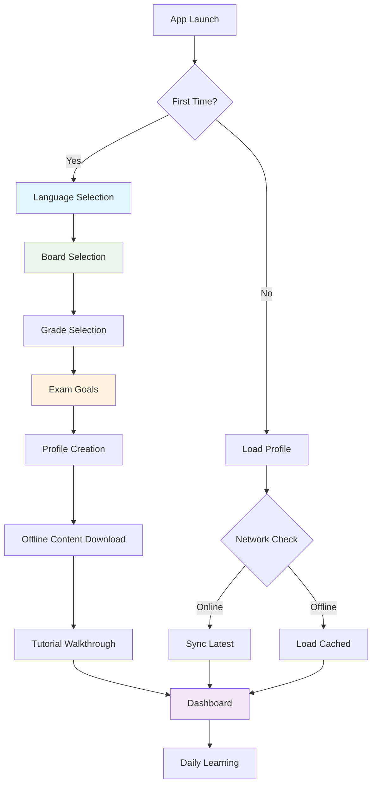
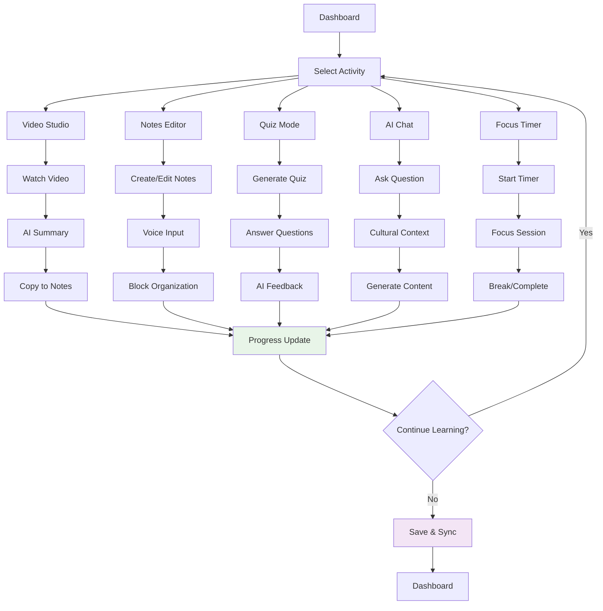
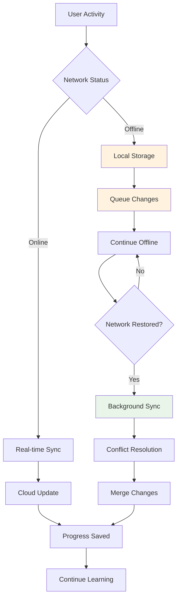

# MindHangar AI for Bharat - Wireframes & Mock Diagrams

## Overview

This document presents comprehensive wireframes and mock diagrams for the MindHangar AI for Bharat platform, showcasing the user interface design, user flows, and key interactions optimized for the Indian education ecosystem.

## 🎯 Design Principles

- **Mobile-First**: Optimized for 4-inch+ smartphone displays
- **Cultural Sensitivity**: Indian themes, colors, and cultural elements
- **Accessibility**: Clear typography, high contrast, touch-friendly controls
- **Offline-First**: Clear indicators for connectivity and data usage
- **Multi-Language**: Support for 8 Indian languages with regional scripts

---

## 📱 Mobile Wireframes

### 1. Onboarding Flow

#### 1.1 Language Selection Screen
```
┌─────────────────────────────────────┐
│  🇮🇳 MindHangar AI for Bharat      │
│                                     │
│     Choose Your Language            │
│     अपनी भाषा चुनें                    │
│                                     │
│  ┌─────────────────────────────────┐ │
│  │  🔤 English                     │ │
│  └─────────────────────────────────┘ │
│  ┌─────────────────────────────────┐ │
│  │  🔤 हिंदी (Hindi)               │ │
│  └─────────────────────────────────┘ │
│  ┌─────────────────────────────────┐ │
│  │  🔤 தமிழ் (Tamil)               │ │
│  └─────────────────────────────────┘ │
│  ┌─────────────────────────────────┐ │
│  │  🔤 తెలుగు (Telugu)             │ │
│  └─────────────────────────────────┘ │
│  ┌─────────────────────────────────┐ │
│  │  🔤 বাংলা (Bengali)             │ │
│  └─────────────────────────────────┘ │
│                                     │
│           [Continue →]              │
│                                     │
│  📶 Offline Mode Available          │
└─────────────────────────────────────┘
```

#### 1.2 Educational Board Selection
```
┌─────────────────────────────────────┐
│  ← Select Your Board                │
│                                     │
│     Which board do you follow?      │
│                                     │
│  ┌─────────────────────────────────┐ │
│  │  📚 CBSE                        │ │
│  │      Central Board of Secondary │ │
│  │      Education                  │ │
│  └─────────────────────────────────┘ │
│  ┌─────────────────────────────────┐ │
│  │  📚 ICSE                        │ │
│  │      Indian Certificate of      │ │
│  │      Secondary Education        │ │
│  └─────────────────────────────────┘ │
│  ┌─────────────────────────────────┐ │
│  │  📚 State Board                 │ │
│  │      Maharashtra / Tamil Nadu / │ │
│  │      Karnataka / Other          │ │
│  └─────────────────────────────────┘ │
│                                     │
│           [Continue →]              │
│                                     │
│  ● ● ○ ○ ○  (Progress: 2/5)         │
└─────────────────────────────────────┘
```

#### 1.3 Grade & Competitive Exam Selection
```
┌─────────────────────────────────────┐
│  ← Grade & Exam Goals               │
│                                     │
│     Select Your Class               │
│  ┌─────┬─────┬─────┬─────┬─────┐   │
│  │  6  │  7  │  8  │  9  │ 10  │   │
│  └─────┴─────┴─────┴─────┴─────┘   │
│  ┌─────┬─────┬─────┬─────┐         │
│  │ 11  │ 12  │ UG  │ PG  │         │
│  └─────┴─────┴─────┴─────┘         │
│                                     │
│     Competitive Exam Goals          │
│  ┌─────────────────────────────────┐ │
│  │ ☐ JEE Main/Advanced             │ │
│  │ ☐ NEET                          │ │
│  │ ☐ UPSC                          │ │
│  │ ☐ CAT                           │ │
│  │ ☐ GATE                          │ │
│  │ ☐ State Level Exams             │ │
│  │ ☐ None                          │ │
│  └─────────────────────────────────┘ │
│                                     │
│           [Continue →]              │
│                                     │
│  ● ● ● ○ ○  (Progress: 3/5)         │
└─────────────────────────────────────┘
```

### 2. Main Dashboard

#### 2.1 Dashboard Overview (Mobile)
```
┌─────────────────────────────────────┐
│  ☰  MindHangar Bharat    🔔 📶 ⚙️  │
│                                     │
│  🙏 Namaste, Priya!                │
│  📅 Today: Diwali Festival          │
│                                     │
│  ┌─────────────────────────────────┐ │
│  │  📊 Today's Progress            │ │
│  │  ████████░░ 80% Complete        │ │
│  │  🔥 7-day streak                │ │
│  └─────────────────────────────────┘ │
│                                     │
│  Quick Actions                      │
│  ┌─────┬─────┬─────┬─────┐         │
│  │ 📝  │ 🎥  │ 📚  │ 🧠  │         │
│  │Notes│Video│Study│Quiz │         │
│  └─────┴─────┴─────┴─────┘         │
│                                     │
│  📋 Recommended for You             │
│  ┌─────────────────────────────────┐ │
│  │ 🧮 Mathematics - Algebra        │ │
│  │ ⏱️ 45 min • CBSE Class 10       │ │
│  │ 🎯 JEE Prep                     │ │
│  └─────────────────────────────────┘ │
│                                     │
│  📱 Offline Content: 2.3GB cached  │
│  📊 Data Used Today: 45MB           │
└─────────────────────────────────────┘
```

#### 2.2 Navigation Drawer
```
┌─────────────────────────────────────┐
│  👤 Priya Sharma                   │
│  📚 CBSE Class 10 • JEE Aspirant   │
│  ────────────────────────────────── │
│                                     │
│  🏠 Dashboard                       │
│  📝 Notes & Editor                  │
│  🎥 Video Studio                    │
│  📚 Study Planner                   │
│  🧠 Quiz & Flashcards              │
│  🤖 AI Chat Assistant              │
│  ⏰ Focus Timer                     │
│  📊 Progress Analytics              │
│  ────────────────────────────────── │
│  👨‍👩‍👧‍👦 Parent Dashboard              │
│  ⚙️ Settings                        │
│  📱 Offline Mode                    │
│  🌐 Language: हिंदी                 │
│  💳 Upgrade Plan                    │
│  ────────────────────────────────── │
│  📞 Help & Support                  │
│  🔒 Privacy Policy                  │
│  📋 Terms of Service               │
│                                     │
└─────────────────────────────────────┘
```

### 3. Core Features

#### 3.1 Video Studio Interface
```
┌─────────────────────────────────────┐
│  ← Video Studio                     │
│                                     │
│  ┌─────────────────────────────────┐ │
│  │  ▶️ Mathematics: Quadratic      │ │
│  │     Equations                   │ │
│  │  ┌─────────────────────────────┐ │ │
│  │  │                             │ │ │
│  │  │    📺 Video Player          │ │ │
│  │  │    [Khan Academy]           │ │ │
│  │  │                             │ │ │
│  │  └─────────────────────────────┘ │ │
│  │  ⏯️ ⏪ ⏩ 🔊 ⚙️ 📱              │ │
│  │  Progress: ████░░░░░ 45%        │ │
│  └─────────────────────────────────┘ │
│                                     │
│  🤖 AI Summary                      │
│  ┌─────────────────────────────────┐ │
│  │ Key Points:                     │ │
│  │ • Quadratic formula: ax²+bx+c=0 │ │
│  │ • Discriminant determines roots │ │
│  │ • Real-world applications in    │ │
│  │   projectile motion             │ │
│  │                                 │ │
│  │ [📝 Copy to Notes] [🧠 Quiz]    │ │
│  └─────────────────────────────────┘ │
│                                     │
│  📊 Data: 12MB used • 📶 3G         │
└─────────────────────────────────────┘
```

#### 3.2 Notes Editor (Block-Based)
```
┌─────────────────────────────────────┐
│  ← Notes Editor                     │
│                                     │
│  📝 Mathematics - Quadratics        │
│  📅 Today, 2:30 PM                  │
│                                     │
│  ┌─────────────────────────────────┐ │
│  │ # Quadratic Equations           │ │
│  │                                 │ │
│  │ ## Definition                   │ │
│  │ A quadratic equation is...      │ │
│  │                                 │ │
│  │ ## Formula                      │ │
│  │ x = (-b ± √(b²-4ac)) / 2a      │ │
│  │                                 │ │
│  │ ## Examples                     │ │
│  │ ☐ Solve: x² + 5x + 6 = 0       │ │
│  │ ☐ Practice: Projectile motion   │ │
│  │                                 │ │
│  │ 🎤 Voice note: "Remember to..." │ │
│  └─────────────────────────────────┘ │
│                                     │
│  ┌─────────────────────────────────┐ │
│  │ + Add block                     │ │
│  │ 📝 Text  📷 Image  🎤 Voice     │ │
│  │ ☐ Todo  📊 Table  🧮 Math      │ │
│  └─────────────────────────────────┘ │
│                                     │
│  💾 Auto-saved • 🌐 Sync pending    │
└─────────────────────────────────────┘
```

#### 3.3 AI Chat Assistant
```
┌─────────────────────────────────────┐
│  ← AI Assistant                     │
│                                     │
│  🤖 MindHangar AI                   │
│  🌍 Cultural Context: India         │
│  🗣️ Language: हिंदी/English         │
│                                     │
│  ┌─────────────────────────────────┐ │
│  │ 👤 Can you explain quadratic    │ │
│  │    equations with an Indian     │ │
│  │    example?                     │ │
│  │                                 │ │
│  │ 🤖 Sure! Let's use cricket as   │ │
│  │    an example. When Virat      │ │
│  │    Kohli hits a six, the ball  │ │
│  │    follows a parabolic path... │ │
│  │                                 │ │
│  │    The height h = -5t² + 20t   │ │
│  │    where t is time in seconds. │ │
│  │                                 │ │
│  │    This is a quadratic equation!│ │
│  │    🏏                           │ │
│  │                                 │ │
│  │ 👤 That's helpful! Can you     │ │
│  │    create a quiz on this?      │ │
│  └─────────────────────────────────┘ │
│                                     │
│  ┌─────────────────────────────────┐ │
│  │ Type your question...           │ │
│  │                          🎤 📤  │ │
│  └─────────────────────────────────┘ │
└─────────────────────────────────────┘
```

#### 3.4 Quiz Interface
```
┌─────────────────────────────────────┐
│  ← Quiz: Quadratic Equations        │
│                                     │
│  Question 3 of 10                   │
│  ████████░░ 80% Complete            │
│  ⏱️ 02:45 remaining                 │
│                                     │
│  🧮 In cricket, if a ball is hit   │
│  with initial velocity 20 m/s at    │
│  45° angle, which equation          │
│  represents its height?             │
│                                     │
│  ┌─────────────────────────────────┐ │
│  │ ○ A) h = 20t                    │ │
│  └─────────────────────────────────┘ │
│  ┌─────────────────────────────────┐ │
│  │ ○ B) h = -5t² + 14t             │ │
│  └─────────────────────────────────┘ │
│  ┌─────────────────────────────────┐ │
│  │ ● C) h = -4.9t² + 14.14t        │ │
│  └─────────────────────────────────┘ │
│  ┌─────────────────────────────────┐ │
│  │ ○ D) h = 14t²                   │ │
│  └─────────────────────────────────┘ │
│                                     │
│  💡 Hint: Consider gravity effect   │
│                                     │
│           [Next Question →]         │
│                                     │
│  🎯 JEE Pattern • 📊 Difficulty: Med│
└─────────────────────────────────────┘
```

#### 3.5 Focus Timer
```
┌─────────────────────────────────────┐
│  ← Focus Session                    │
│                                     │
│  🧘‍♀️ Deep Focus Mode                │
│  📚 Subject: Mathematics            │
│  🎯 Goal: Complete Chapter 4        │
│                                     │
│  ┌─────────────────────────────────┐ │
│  │                                 │ │
│  │         ⏰ 25:00                │ │
│  │                                 │ │
│  │    🌸 Lotus Meditation Theme    │ │
│  │                                 │ │
│  │     ████████████████████        │ │
│  │                                 │ │
│  └─────────────────────────────────┘ │
│                                     │
│  📱 Phone notifications: BLOCKED    │
│  🔇 Distracting apps: DISABLED      │
│  👁️ Focus tracking: ON              │
│                                     │
│  ┌─────────────────────────────────┐ │
│  │ ⏸️ Pause    🛑 Stop    ⚙️ Settings│ │
│  └─────────────────────────────────┘ │
│                                     │
│  🔥 Current streak: 7 sessions      │
│  📊 Today's focus: 2h 15m           │
│                                     │
│  🎵 Background: Temple bells        │
└─────────────────────────────────────┘
```

---

## 💻 Desktop/Tablet Wireframes

### 1. Spatial Workspace Layout

#### 1.1 Studio Layout (Balanced)
```
┌─────────────────────────────────────────────────────────────────────────────────────┐
│  ☰ MindHangar AI for Bharat    🔍 Search    🔔 Notifications    👤 Priya    ⚙️     │
├─────────────────────────────────────────────────────────────────────────────────────┤
│                                                                                     │
│  ┌─────────────────────┐  ┌─────────────────────────────────────────────────────┐  │
│  │   📚 Study Planner  │  │              🎥 Video Studio                        │  │
│  │                     │  │  ┌─────────────────────────────────────────────────┐ │  │
│  │  📅 Today's Plan    │  │  │                                                 │ │  │
│  │  ☐ Math: Quadratic │  │  │         📺 Video Player                         │ │  │
│  │  ☐ Physics: Motion │  │  │         [Educational Content]                   │ │  │
│  │  ☐ Chemistry: Acids│  │  │                                                 │ │  │
│  │                     │  │  └─────────────────────────────────────────────────┘ │  │
│  │  🎯 JEE Prep        │  │  ⏯️ ⏪ ⏩ 🔊 ⚙️ Progress: ████░░░░░ 45%            │  │
│  │  📊 Progress: 75%   │  │                                                     │  │
│  │                     │  │  🤖 AI Summary                                      │  │
│  │  🔥 7-day streak    │  │  • Key concepts explained                           │  │
│  │                     │  │  • Practice problems generated                      │  │
│  └─────────────────────┘  │  • Cultural context: Cricket physics               │  │
│                           └─────────────────────────────────────────────────────┘  │
│  ┌─────────────────────────────────────────────────────────────────────────────┐  │
│  │                           📝 Notes Editor                                   │  │
│  │                                                                             │  │
│  │  # Physics - Projectile Motion                                             │  │
│  │                                                                             │  │
│  │  ## Cricket Ball Trajectory                                                │  │
│  │  When Dhoni hits a six, the ball follows a parabolic path...              │  │
│  │                                                                             │  │
│  │  ## Equations                                                              │  │
│  │  x = v₀ cos θ × t                                                          │  │
│  │  y = v₀ sin θ × t - ½gt²                                                   │  │
│  │                                                                             │  │
│  │  [+ Add Block] 📝 Text  📷 Image  🎤 Voice  ☐ Todo  📊 Table             │  │
│  └─────────────────────────────────────────────────────────────────────────────┘  │
│                                                                                     │
│  📊 Status: 📶 Online • 💾 Synced • 🌐 हिंदी • 📱 Mobile Paired                   │
└─────────────────────────────────────────────────────────────────────────────────────┘
```

#### 1.2 Cinema Layout (Video-Focused)
```
┌─────────────────────────────────────────────────────────────────────────────────────┐
│  ☰ MindHangar AI for Bharat                                    Cinema Mode    ⚙️   │
├─────────────────────────────────────────────────────────────────────────────────────┤
│                                                                                     │
│  ┌─────────────────────────────────────────────────────────────────────────────┐  │
│  │                              🎥 Video Studio                                │  │
│  │                                                                             │  │
│  │  ┌─────────────────────────────────────────────────────────────────────┐   │  │
│  │  │                                                                     │   │  │
│  │  │                                                                     │   │  │
│  │  │                    📺 Full-Screen Video                             │   │  │
│  │  │                    [Educational Content]                           │   │  │
│  │  │                                                                     │   │  │
│  │  │                                                                     │   │  │
│  │  └─────────────────────────────────────────────────────────────────────┘   │  │
│  │                                                                             │  │
│  │  ⏯️ ⏪ ⏩ 🔊 ⚙️ 📱 Progress: ████████░░ 80%                                │  │
│  │                                                                             │  │
│  └─────────────────────────────────────────────────────────────────────────────┘  │
│                                                                                     │
│  ┌─────────────────────┐  ┌─────────────────────────────────────────────────────┐  │
│  │   🤖 AI Assistant   │  │              📝 Quick Notes                         │  │
│  │                     │  │                                                     │  │
│  │  💬 Ask about video │  │  • Projectile motion formula                        │  │
│  │  🧠 Generate quiz   │  │  • Cricket example: Dhoni's six                    │  │
│  │  📚 Related topics  │  │  • Practice: Calculate max height                  │  │
│  │  🎯 Practice tests  │  │                                                     │  │
│  │                     │  │  [📝 Expand Editor] [🧠 Create Quiz]               │  │
│  └─────────────────────┘  └─────────────────────────────────────────────────────┘  │
│                                                                                     │
└─────────────────────────────────────────────────────────────────────────────────────┘
```

### 2. Parent/Teacher Dashboard

#### 2.1 Parent Dashboard
```
┌─────────────────────────────────────────────────────────────────────────────────────┐
│  👨‍👩‍👧‍👦 Parent Dashboard - Priya Sharma                                              │
├─────────────────────────────────────────────────────────────────────────────────────┤
│                                                                                     │
│  ┌─────────────────────┐  ┌─────────────────────┐  ┌─────────────────────────────┐  │
│  │   📊 Today's Stats  │  │   📅 This Week      │  │     🎯 Goals Progress       │  │
│  │                     │  │                     │  │                             │  │
│  │  ⏰ Study Time      │  │  📚 Subjects        │  │  🧮 Mathematics: 85%        │  │
│  │     2h 45m          │  │  • Math: 8h         │  │  ⚗️ Chemistry: 72%          │  │
│  │                     │  │  • Physics: 6h      │  │  🔬 Physics: 90%            │  │
│  │  🔥 Streak          │  │  • Chemistry: 4h    │  │                             │  │
│  │     7 days          │  │                     │  │  🎯 JEE Prep: On Track      │  │
│  │                     │  │  🧠 Quizzes: 12     │  │                             │  │
│  │  📱 Screen Time     │  │  📝 Notes: 25       │  │  📅 Next Milestone:        │  │
│  │     3h 20m          │  │                     │  │     Mock Test - Dec 15      │  │
│  └─────────────────────┘  └─────────────────────┘  └─────────────────────────────┘  │
│                                                                                     │
│  ┌─────────────────────────────────────────────────────────────────────────────┐  │
│  │                        📈 Performance Analytics                             │  │
│  │                                                                             │  │
│  │  Subject Performance (Last 30 Days)                                        │  │
│  │  Mathematics  ████████████████████░░ 85%                                   │  │
│  │  Physics      ████████████████████████ 90%                                 │  │
│  │  Chemistry    ██████████████░░░░░░░░░░ 72%                                 │  │
│  │                                                                             │  │
│  │  📊 Compared to National Average: +15%                                     │  │
│  │  🏆 Rank in Class: 3rd out of 45 students                                 │  │
│  │                                                                             │  │
│  └─────────────────────────────────────────────────────────────────────────────┘  │
│                                                                                     │
│  ┌─────────────────────┐  ┌─────────────────────────────────────────────────────┐  │
│  │   ⚠️ Alerts         │  │              📋 Recent Activity                     │  │
│  │                     │  │                                                     │  │
│  │  🔴 Chemistry quiz  │  │  📝 Completed: Quadratic Equations                 │  │
│  │     score below 70% │  │  🎥 Watched: Physics - Projectile Motion           │  │
│  │                     │  │  🧠 Quiz: Mathematics - 85% score                  │  │
│  │  🟡 Missed study    │  │  📚 Added notes: Chemistry - Acids & Bases         │  │
│  │     session yesterday│  │  ⏰ Focus session: 45 minutes                      │  │
│  │                     │  │                                                     │  │
│  │  [View Details]     │  │  [View All Activity]                               │  │
│  └─────────────────────┘  └─────────────────────────────────────────────────────┘  │
│                                                                                     │
│  ┌─────────────────────────────────────────────────────────────────────────────┐  │
│  │                           ⚙️ Parental Controls                              │  │
│  │                                                                             │  │
│  │  📱 Screen Time Limits: ✅ Enabled (4 hours/day)                           │  │
│  │  🚫 Content Filtering: ✅ Age-appropriate content only                      │  │
│  │  ⏰ Study Schedule: ✅ Enforced (6 PM - 9 PM daily)                        │  │
│  │  📧 Progress Reports: ✅ Weekly email summaries                             │  │
│  │                                                                             │  │
│  │  [Modify Settings] [Generate Report] [Contact Teacher]                     │  │
│  └─────────────────────────────────────────────────────────────────────────────┘  │
└─────────────────────────────────────────────────────────────────────────────────────┘
```

### 3. Settings & Configuration

#### 3.1 Settings Panel
```
┌─────────────────────────────────────────────────────────────────────────────────────┐
│  ⚙️ Settings                                                                        │
├─────────────────────────────────────────────────────────────────────────────────────┤
│                                                                                     │
│  ┌─────────────────────┐  ┌─────────────────────────────────────────────────────┐  │
│  │   🌐 Language       │  │              🎨 Appearance                          │  │
│  │                     │  │                                                     │  │
│  │  Interface Language │  │  Theme                                              │  │
│  │  ┌─────────────────┐│  │  ○ Light Mode                                      │  │
│  │  │ हिंदी (Hindi)   ││  │  ● Dark Mode                                       │  │
│  │  └─────────────────┘│  │  ○ Auto (System)                                   │  │
│  │                     │  │                                                     │  │
│  │  Content Language   │  │  Cultural Theme                                     │  │
│  │  ☑️ Hindi           │  │  ● Indian Festival Colors                          │  │
│  │  ☑️ English         │  │  ○ Minimal                                         │  │
│  │  ☐ Tamil            │  │  ○ Classic                                         │  │
│  │  ☐ Telugu           │  │                                                     │  │
│  │                     │  │  Font Size                                          │  │
│  │  🎤 Voice Language  │  │  ○ Small  ● Medium  ○ Large                        │  │
│  │  ┌─────────────────┐│  │                                                     │  │
│  │  │ Hindi (Delhi)   ││  │  Regional Script                                    │  │
│  │  └─────────────────┘│  │  ● Devanagari  ○ Roman                            │  │
│  └─────────────────────┘  └─────────────────────────────────────────────────────┘  │
│                                                                                     │
│  ┌─────────────────────┐  ┌─────────────────────────────────────────────────────┐  │
│  │   📚 Education      │  │              📱 Connectivity                        │  │
│  │                     │  │                                                     │  │
│  │  Board              │  │  Network Mode                                       │  │
│  │  ┌─────────────────┐│  │  ● Auto-detect                                     │  │
│  │  │ CBSE            ││  │  ○ Always Online                                   │  │
│  │  └─────────────────┘│  │  ○ Offline First                                   │  │
│  │                     │  │                                                     │  │
│  │  Class: 10th        │  │  Data Usage                                         │  │
│  │                     │  │  ● Low Bandwidth Mode                              │  │
│  │  Competitive Exams  │  │  ○ Standard Quality                                │  │
│  │  ☑️ JEE Main/Adv    │  │  ○ High Quality                                    │  │
│  │  ☐ NEET             │  │                                                     │  │
│  │  ☐ UPSC             │  │  📊 Data Used Today: 45MB                          │  │
│  │                     │  │  💾 Offline Content: 2.3GB                         │  │
│  │  🎯 Study Goals     │  │                                                     │  │
│  │  Daily: 3 hours     │  │  📱 Mobile Pairing                                 │  │
│  │  Weekly: 21 hours   │  │  ● Connected: iPhone 12                            │  │
│  └─────────────────────┘  └─────────────────────────────────────────────────────┘  │
│                                                                                     │
│  ┌─────────────────────────────────────────────────────────────────────────────┐  │
│  │                           🔐 Privacy & Security                             │  │
│  │                                                                             │  │
│  │  Data Storage                                                               │  │
│  │  ● Local Storage (Recommended for Privacy)                                 │  │
│  │  ○ Cloud Sync (Google Drive)                                               │  │
│  │  ○ Government Platform Sync (DIKSHA)                                       │  │
│  │                                                                             │  │
│  │  Parental Controls                                                          │  │
│  │  ☑️ Enable parent notifications                                             │  │
│  │  ☑️ Content filtering                                                       │  │
│  │  ☑️ Screen time limits                                                      │  │
│  │                                                                             │  │
│  │  AI & Analytics                                                            │  │
│  │  ☑️ Personalized recommendations                                            │  │
│  │  ☑️ Performance analytics                                                   │  │
│  │  ☐ Usage data sharing (for research)                                       │  │
│  │                                                                             │  │
│  │  [Export Data] [Delete Account] [Privacy Policy]                           │  │
│  └─────────────────────────────────────────────────────────────────────────────┘  │
└─────────────────────────────────────────────────────────────────────────────────────┘
```

---

## 🔄 User Flow Diagrams

### 1. Complete Onboarding Flow


### 2. Learning Session Flow


### 3. Offline-Online Sync Flow


---

## 📊 Data Visualization Mockups

### 1. Progress Analytics
```
┌─────────────────────────────────────────────────────────────────────────────────────┐
│  📊 Progress Analytics - Last 30 Days                                              │
├─────────────────────────────────────────────────────────────────────────────────────┤
│                                                                                     │
│  ┌─────────────────────────────────────────────────────────────────────────────┐  │
│  │                        📈 Study Time Trends                                 │  │
│  │                                                                             │  │
│  │   Hours                                                                     │  │
│  │    4 ┤                                    ●                                │  │
│  │    3 ┤              ●           ●      ●     ●                             │  │
│  │    2 ┤        ●  ●     ●     ●     ●           ●                          │  │
│  │    1 ┤     ●           ●  ●                       ●                       │  │
│  │    0 └─────────────────────────────────────────────────────────────────   │  │
│  │      Nov 1    Nov 8    Nov 15   Nov 22   Nov 29                           │  │
│  │                                                                             │  │
│  │  📊 Average: 2.5h/day  🎯 Goal: 3h/day  📈 Trend: +15%                   │  │
│  └─────────────────────────────────────────────────────────────────────────────┘  │
│                                                                                     │
│  ┌─────────────────────┐  ┌─────────────────────┐  ┌─────────────────────────────┐  │
│  │   🎯 Subject Focus  │  │   🧠 Quiz Scores    │  │     🏆 Achievements         │  │
│  │                     │  │                     │  │                             │  │
│  │  Mathematics        │  │  Math: 85% avg      │  │  🔥 7-day streak            │  │
│  │  ████████████ 60%   │  │  Physics: 92% avg   │  │  📚 100 notes created      │  │
│  │                     │  │  Chemistry: 78% avg │  │  🎥 50 videos completed     │  │
│  │  Physics            │  │                     │  │  🧠 500 quiz questions      │  │
│  │  ████████ 30%       │  │  📈 Improvement:    │  │  ⏰ 100 hours studied       │  │
│  │                     │  │  +12% this month    │  │                             │  │
│  │  Chemistry          │  │                     │  │  🎖️ Top 5% nationally      │  │
│  │  ██████ 25%         │  │  🎯 JEE Mock: 78%   │  │                             │  │
│  └─────────────────────┘  └─────────────────────┘  └─────────────────────────────┘  │
└─────────────────────────────────────────────────────────────────────────────────────┘
```

### 2. Cultural Calendar Integration
```
┌─────────────────────────────────────────────────────────────────────────────────────┐
│  📅 Cultural Learning Calendar - November 2024                                     │
├─────────────────────────────────────────────────────────────────────────────────────┤
│                                                                                     │
│   Sun    Mon    Tue    Wed    Thu    Fri    Sat                                    │
│                              1       2       3                                     │
│                           📚Math  🎥Physics 🧠Quiz                                 │
│                                                                                     │
│    4       5       6       7       8       9      10                              │
│  🪔Diwali 📝Notes  📚Study  🎥Video  📊Test   Rest   🏏Sports                      │
│  🎉Festival                                                                        │
│                                                                                     │
│   11      12      13      14      15      16      17                              │
│  📚Math  🧪Chem   📝Notes  🎥Physics 📊Mock   📚Rev  🎭Cultural                    │
│                                     Test           Event                           │
│                                                                                     │
│   18      19      20      21      22      23      24                              │
│  📚Study 🎥Video  📝Notes  🧠Quiz   📊Test  📚Rev   Rest                          │
│                                                                                     │
│   25      26      27      28      29      30                                      │
│  📚Math  🧪Chem   📝Notes  🎥Physics 📊Final       📊Results                      │
│                            Test                                                    │
│                                                                                     │
│  ┌─────────────────────────────────────────────────────────────────────────────┐  │
│  │  🎉 Upcoming Festivals & Events                                            │  │
│  │                                                                             │  │
│  │  🪔 Diwali (Nov 4) - Festival of Lights                                   │  │
│  │     📚 Special: Mathematics with Rangoli Patterns                          │  │
│  │     🎥 Physics: Light and Optics                                           │  │
│  │                                                                             │  │
│  │  🏏 Cricket World Cup (Nov 19) - Sports Day                               │  │
│  │     📊 Statistics and Probability                                          │  │
│  │     ⚗️ Physics: Projectile Motion                                          │  │
│  │                                                                             │  │
│  │  🎭 Regional Cultural Event (Nov 17)                                      │  │
│  │     📝 Essay: Cultural Heritage                                            │  │
│  │     🎨 Art: Traditional Patterns in Geometry                              │  │
│  └─────────────────────────────────────────────────────────────────────────────┘  │
└─────────────────────────────────────────────────────────────────────────────────────┘
```

---

## 🎨 Visual Design Elements

### Color Palette (Indian Cultural Theme)
- **Primary**: Saffron (#FF9933) - Energy, Learning
- **Secondary**: White (#FFFFFF) - Purity, Clarity  
- **Accent**: Green (#138808) - Growth, Progress
- **Background**: Light Blue (#E3F2FD) - Calm, Focus
- **Text**: Dark Blue (#1565C0) - Trust, Stability
- **Success**: Green (#4CAF50) - Achievement
- **Warning**: Orange (#FF9800) - Attention
- **Error**: Red (#F44336) - Alerts

### Typography
- **Headers**: Noto Sans (Multi-script support)
- **Body**: Inter (Readability optimized)
- **Regional**: Noto Sans Devanagari, Tamil, Telugu, Bengali
- **Math**: KaTeX fonts for equations

### Icons & Imagery
- **Cultural Icons**: Lotus, Om, Rangoli patterns
- **Educational**: Books, graduation cap, lightbulb
- **Technology**: Smartphone, tablet, cloud sync
- **Indian Context**: Cricket, festivals, monuments

This comprehensive wireframe and mockup documentation provides a complete visual guide for implementing the MindHangar AI for Bharat platform, ensuring cultural sensitivity, accessibility, and optimal user experience across all devices and use cases.